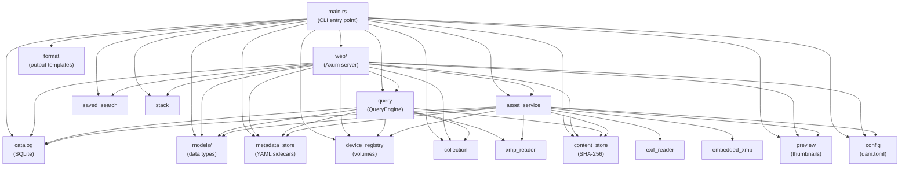

# Module Reference

This document describes the modules that make up the `dam` crate. All source code lives under `src/`.

## Module Dependency Graph



## Module Table

| Module | File(s) | Purpose |
|--------|---------|---------|
| `ai` | `src/ai.rs` | *Feature-gated (`ai`)*. SigLIP ViT-B/16-256 model wrapper. ONNX session management for vision and text encoders, image preprocessing (256×256 squash resize, normalize to [-1,1] CHW tensor), SentencePiece tokenization (pad to 64 tokens), sigmoid scoring (`logit_scale * dot + logit_bias`), and ~100 default photography labels. Provides `SigLipModel` with `encode_image()`, `encode_texts()`, and `classify()`. |
| `asset_service` | `src/asset_service.rs` | Orchestrates import, export, grouping, auto-grouping, auto-tagging, relocate, delete, and preview generation. Coordinates between content store, metadata store, catalog, EXIF/XMP readers, and preview generator. Entry point for all write operations that involve multiple subsystems. |
| `catalog` | `src/catalog.rs` | SQLite database operations: schema creation, migrations, CRUD for assets/variants/recipes/locations, search queries with pagination and filtering, statistics, and tag management. Provides `Catalog::open()` (with migrations) and `Catalog::open_fast()` (skip migrations, for per-request use in the web server). |
| `collection` | `src/collection.rs` | Collection (static album) persistence. Dual storage: SQLite tables (`collections`, `collection_assets`) for fast queries, plus `collections.yaml` at catalog root for rebuild resilience. Provides `CollectionStore` with create, list, add/remove assets, and export/import operations. |
| `config` | `src/config.rs` | Parses and validates `dam.toml` configuration file. Defines `CatalogConfig` with sub-structs `PreviewConfig` (max_edge, format, quality), `ServeConfig` (port, bind), `ImportConfig` (exclude globs, auto_tags), and `AiConfig` (threshold, labels, model_dir, prompt). All sections are optional with sensible defaults. |
| `content_store` | `src/content_store.rs` | SHA-256 content hashing for content-addressable storage. Provides `hash_file()` for computing file digests used as variant identity and integrity verification. |
| `embedding_store` | `src/embedding_store.rs` | *Feature-gated (`ai`)*. SQLite-backed vector storage for 768-dim image embeddings. Provides `EmbeddingStore` with `store()`, `get()`, `find_similar()` (brute-force cosine similarity), `has_embedding()`, `count()`, and `remove()`. Embeddings stored as little-endian f32 BLOBs. Table: `embeddings(asset_id TEXT PK, embedding BLOB, model TEXT)`. |
| `device_registry` | `src/device_registry.rs` | Volume registration and online detection. Manages the `volumes.yaml` file at the catalog root. Detects whether volumes are online by checking mount point existence. Provides `find_volume_for_path()` to auto-detect which volume contains a given file path. |
| `embedded_xmp` | `src/embedded_xmp.rs` | Extracts XMP metadata embedded in JPEG and TIFF binary data (APP1 marker for JPEG, IFD tag 700 for TIFF). Returns parsed XMP data for merging during import. Supported formats: `.jpg`/`.jpeg`/`.tif`/`.tiff`; all other extensions return empty immediately with zero I/O. |
| `exif_reader` | `src/exif_reader.rs` | EXIF metadata extraction from image files using the `kamadak-exif` crate. Extracts camera make/model, lens, focal length, aperture, shutter speed, ISO, date/time, GPS coordinates, dimensions, and orientation. Provides `apply_exif_orientation()` for auto-rotating images based on EXIF orientation tags, and `apply_rotation()` for manual rotation overrides (used by preview generation). |
| `format` | `src/format.rs` | Output format template engine for CLI commands. Supports preset formats (`ids`, `short`, `full`, `json`) and custom templates with `{placeholder}` substitution and escape sequences (`\t`, `\n`). Used by `search --format` and `duplicates --format`. |
| `model_manager` | `src/model_manager.rs` | *Feature-gated (`ai`)*. Download and cache management for SigLIP ONNX model files from HuggingFace (Xenova/siglip-base-patch16-256). Downloads `vision_model_quantized.onnx`, `text_model_quantized.onnx`, and `tokenizer.json` via curl. Provides `ModelManager` with `ensure_model()`, `download_model()`, `remove_model()`, `list_files()`, `total_size()`. Default cache dir: `~/.dam/models/siglip-vit-b16-256/`. |
| `metadata_store` | `src/metadata_store.rs` | YAML sidecar file read/write operations. Sidecars are the source of truth for asset metadata. Stored at `assets/<id-prefix>/<id>.yaml` within the catalog root. Handles serialization/deserialization of `Asset` structs with all nested variants, recipes, locations, and tags. |
| `models` | `src/models/` | Core data structures shared across all modules. Split into sub-modules: |
| | `src/models/mod.rs` | Re-exports and shared types (`Asset`, `FileLocation`) |
| | `src/models/asset.rs` | `Asset` struct: id, name, description, asset_type, tags, rating, color_label, created_at, variants. Includes `validate_color_label()` for the 7-color set. |
| | `src/models/variant.rs` | `Variant` struct: content_hash, original_filename, format, role, file_size, source_metadata, file_locations, recipes. Includes `best_preview_index()` / `best_preview_index_details()` for display variant selection, and `compute_best_variant_hash()` / `compute_primary_format()` for denormalized column computation. |
| | `src/models/recipe.rs` | `Recipe` struct: recipe_type, relative_path, volume_id, content_hash. Represents processing sidecars (XMP, COS, pp3, etc.) attached to variants. |
| | `src/models/volume.rs` | `Volume` struct: id, label, mount_point, is_online. |
| `preview` | `src/preview.rs` | Preview/thumbnail generation. Standard images use the `image` crate (resized to configurable max edge, default 800px). RAW files use `dcraw` or `dcraw_emu` (LibRaw). Videos use `ffmpeg`. Non-visual formats get info cards rendered with `imageproc`/`ab_glyph`. Previews stored at `previews/<hash-prefix>/<hash>.{jpg,webp}`. |
| `query` | `src/query.rs` | Search query parsing and `QueryEngine` orchestration. Parses filter syntax (`tag:X`, `rating:N+`, `label:Red`, `collection:X`, `path:prefix`, `orphan:true`, `missing:true`, `stale:N`, `volume:none`). `QueryEngine` wraps catalog + metadata store + device registry to provide high-level operations: `search`, `show`, `tag`, `edit`, `set_rating`, `set_description`, `set_name`, `set_color_label`, `auto_group`, `fix_roles`. Includes path normalization for volume-relative prefix matching. |
| `saved_search` | `src/saved_search.rs` | Saved search (smart album) persistence. Stores named queries in `searches.toml` at the catalog root. Provides `load()`, `save()`, and `SavedSearch` struct with `to_url_params()` for web UI chip rendering. |
| `stack` | `src/stack.rs` | Stack (scene grouping) persistence. Dual storage: SQLite `stacks` table for fast queries + `stacks.yaml` at catalog root for rebuild resilience. Provides `StackStore` with create, add, remove, set_pick, dissolve, list, and export/import operations. Assets in a stack have `stack_id` and `stack_position` columns on the `assets` table. Position 0 is the pick (displayed in browse grid when stacks are collapsed). |
| `web` | `src/web/` | Axum web server. Split into sub-modules: |
| | `src/web/mod.rs` | Server setup, router construction, `AppState`, request logging middleware, graceful shutdown. |
| | `src/web/routes.rs` | All HTTP route handlers: browse, asset detail, tags page, stats page, collections page, search API, asset editing endpoints, batch operations, saved search CRUD, collection CRUD. |
| | `src/web/templates.rs` | Askama HTML templates and template helper structs (`BrowsePage`, `ResultsPartial`, `AssetPage`, `AssetCard`, `TagsPage`, `StatsPage`, `CollectionsPage`, and HTML fragment types for htmx partial updates). |
| | `src/web/static_assets.rs` | Compile-time embedded static files (`htmx.min.js`, `style.css`) served as in-memory responses. |
| `xmp_reader` | `src/xmp_reader.rs` | XMP sidecar parsing and write-back. Reads XMP files to extract `dc:subject` (tags), `dc:description`, `xmp:Rating`, `xmp:Label`, `dc:creator`, `dc:rights`. Write-back functions: `update_rating()`, `update_label()`, `update_tags()` (operation-level deltas), `update_description()`. Handles XML escaping, namespace injection, and `rdf:Description` format conversion. |

## Generated API Documentation

For detailed Rust API documentation with full type signatures, run:

```bash
cargo doc --no-deps --open
```

This generates HTML documentation from doc comments in the source code and opens it in your browser. The output is written to `target/doc/dam/`.
