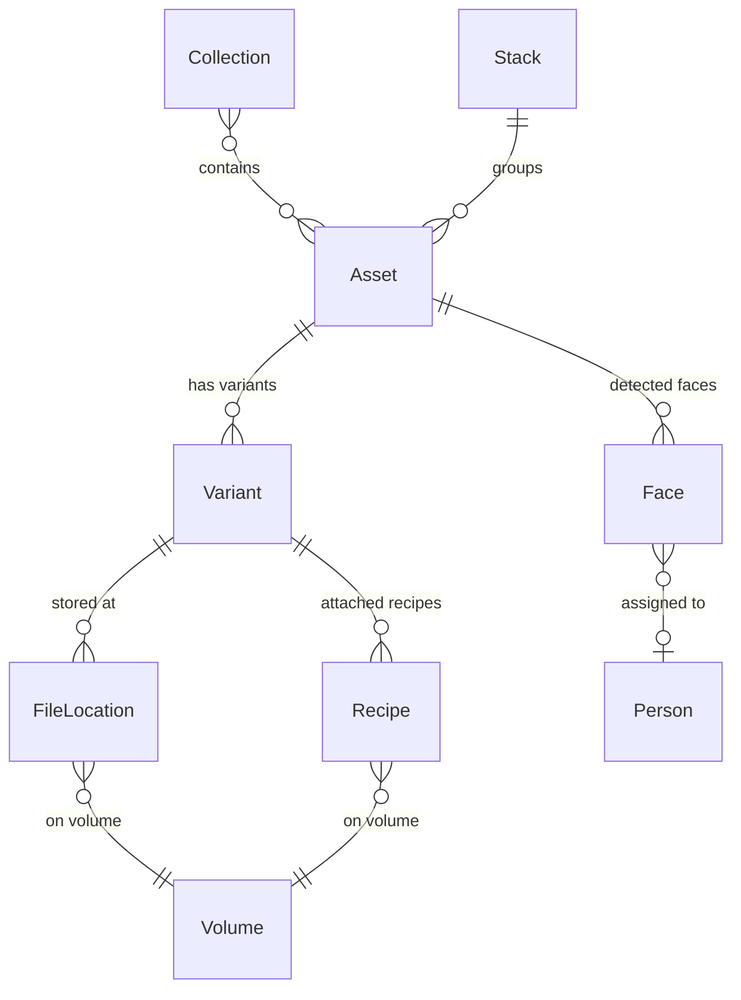

# Data Model

This page documents every entity in the MAKI data model, their fields, relationships, and storage mechanisms.

---

## Entities

### Asset

The top-level entity. An Asset represents a single logical media item -- "photo of sunset at the beach" -- regardless of how many physical files exist for it.

| Field | Type | Description |
|-------|------|-------------|
| `id` | UUID | Primary key. Deterministic UUID v5 derived from the content hash of the first variant. Same content always produces the same asset ID. |
| `name` | Option\<String\> | User-assigned display name. When absent, the UI shows `original_filename` as a fallback. |
| `original_filename` | String | Filename of the primary variant at import time (e.g. `DSC_4521.NEF`). Used as display fallback and for stem-based grouping. |
| `asset_type` | AssetType | One of: `image`, `video`, `audio`, `document`, `other`. Inferred from file extension at import. |
| `description` | Option\<String\> | Free-text description. Extracted from XMP `dc:description` during import, or set manually. |
| `tags` | Vec\<String\> | Keyword list. Merged from XMP `dc:subject`, embedded XMP, and manual tagging. Deduplicated. |
| `rating` | Option\<u8\> | Star rating, 1--5. Extracted from XMP `xmp:Rating` during import, or set manually. |
| `color_label` | Option\<String\> | One of 7 canonical colors: Red, Orange, Yellow, Green, Blue, Pink, Purple. Extracted from XMP `xmp:Label`, or set manually. Stored as title-case English name. |
| `created_at` | DateTime\<Utc\> | Creation timestamp. Preferentially from EXIF `DateTimeOriginal`, falling back to filesystem modification time. |
| `variants` | Vec\<Variant\> | The physical files belonging to this asset (in YAML sidecar). |
| `recipes` | Vec\<Recipe\> | Processing sidecars attached to this asset's variants (in YAML sidecar). |

**Denormalized columns** (SQLite only, computed at write time to avoid expensive JOINs):

| Column | Type | Description |
|--------|------|-------------|
| `best_variant_hash` | String | Content hash of the best display variant (see [Display Priority](#display-priority)). Used for the browse grid JOIN. |
| `primary_variant_format` | String | Identity format of the asset. Prefers Original+RAW, then Original+any, then best variant's format. Shown on browse cards (e.g. "NEF"). |
| `variant_count` | Integer | Number of variants. Shown as a badge on browse cards (e.g. "3v"). |
| `face_count` | Integer | Number of detected faces. Shown as a badge on browse cards. *(MAKI Pro)* |
| `stack_id` | Option\<UUID\> | Foreign key to the Stack this asset belongs to. `None` if unstacked. |
| `stack_position` | Option\<Integer\> | Position within the stack (0 = pick). `None` if unstacked. |

The variant-related columns are updated by `insert_asset()`, `update_denormalized_variant_columns()`, and `fix_roles`. The stack columns are updated by `StackStore` operations. All are backfilled during schema migration and rebuilt by `rebuild-catalog`.

### Variant

A concrete file belonging to an Asset. A RAW file, its JPEG conversion, and a high-res TIFF export are three Variants of the same Asset.

| Field | Type | Description |
|-------|------|-------------|
| `content_hash` | String | Primary key. SHA-256 hash of the file contents. The same file always produces the same hash regardless of where it is stored. |
| `asset_id` | UUID | Foreign key to the parent Asset. |
| `role` | VariantRole | Purpose within the asset group: `original`, `alternate`, `processed`, `export`, or `sidecar`. See [Variant Roles](#variant-roles). |
| `format` | String | Lowercase file extension without dot (e.g. `nef`, `jpg`, `tif`, `mp4`). |
| `file_size` | u64 | File size in bytes. |
| `original_filename` | String | Filename at import time (e.g. `DSC_4521.NEF`). |
| `source_metadata` | HashMap\<String, String\> | Key-value pairs from EXIF and XMP extraction (camera model, lens, GPS coordinates, creator, rights, etc.). |
| `locations` | Vec\<FileLocation\> | Where this file physically exists on disk (in YAML sidecar; stored in a separate `file_locations` table in SQLite). |

**Indexed metadata columns** (SQLite only, extracted from `source_metadata` for fast filtering):

| Column | Type | Description |
|--------|------|-------------|
| `camera_model` | String | Camera body (e.g. "NIKON Z 9") |
| `lens_model` | String | Lens (e.g. "NIKKOR Z 50mm f/1.2 S") |
| `focal_length_mm` | Real | Focal length in millimeters |
| `f_number` | Real | Aperture f-number |
| `iso` | Integer | ISO sensitivity |
| `image_width` | Integer | Image width in pixels |
| `image_height` | Integer | Image height in pixels |

### FileLocation

A pointer to where a Variant physically lives on disk. A single Variant can have multiple FileLocations -- copies on different drives, backups, archives.

| Field | Type | Description |
|-------|------|-------------|
| `id` | Integer | Primary key (auto-increment, SQLite only). |
| `content_hash` | String | Foreign key to the parent Variant. |
| `volume_id` | UUID | Foreign key to the Volume where the file resides. |
| `relative_path` | String | Path relative to the volume's mount point (e.g. `Capture/2026-02-22/DSC_4521.NEF`). |
| `verified_at` | Option\<DateTime\<Utc\>\> | Timestamp of the last successful integrity check via `maki verify`. `None` if never verified. |

### Recipe

A processing sidecar file attached to a Variant. Unlike Variants, Recipes are identified by **location** (volume + path) rather than content hash, because external tools like CaptureOne routinely modify them in place.

| Field | Type | Description |
|-------|------|-------------|
| `id` | UUID | Primary key. |
| `variant_hash` | String | Foreign key to the parent Variant. |
| `software` | String | Processing tool identifier: `XMP`, `CaptureOne`, `RawTherapee`, `DxO`, `ON1`. |
| `recipe_type` | RecipeType | Either `sidecar` (external file) or `embedded_export`. |
| `content_hash` | String | SHA-256 hash of the recipe file. Updated when the file changes on disk. |
| `volume_id` | UUID | Foreign key to the Volume where the recipe file resides. |
| `relative_path` | String | Path relative to the volume's mount point. |
| `verified_at` | Option\<DateTime\<Utc\>\> | Last verification timestamp. |

**Supported recipe file extensions**:

| Extension | Software |
|-----------|----------|
| `.xmp` | XMP (Lightroom, CaptureOne, Adobe) |
| `.cos` | CaptureOne settings |
| `.cot` | CaptureOne output |
| `.cop` | CaptureOne process |
| `.pp3` | RawTherapee |
| `.dop` | DxO PhotoLab |
| `.on1` | ON1 Photo RAW |

### Volume

A registered storage device. Volumes give MAKI a stable reference to storage that may come and go (external drives, network shares).

| Field | Type | Description |
|-------|------|-------------|
| `id` | UUID | Primary key (random UUID v4). |
| `label` | String | Human-readable name (e.g. "Photos SSD", "Archive NAS"). |
| `mount_point` | PathBuf | Filesystem path where the volume is mounted (e.g. `/Volumes/Photos`). |
| `volume_type` | VolumeType | One of: `local`, `external`, `network`. |
| `purpose` | Option\<VolumePurpose\> | Logical role: `working` (active editing), `archive` (long-term primary), `backup` (redundancy), `cloud` (sync folder). Optional — unclassified if not set. Used by duplicate analysis and backup coverage commands. |
| `is_online` | bool | Computed at runtime -- `true` if `mount_point` exists on disk. Not persisted. |

### Collection

A manually curated list of assets (static album). Backed by both SQLite (for fast queries) and `collections.yaml` (for persistence across catalog rebuilds).

| Field | Type | Description |
|-------|------|-------------|
| `id` | UUID | Primary key. |
| `name` | String | Unique human-readable name (e.g. "Portfolio", "Client Deliverables"). |
| `description` | Option\<String\> | Optional description text. |
| `created_at` | DateTime\<Utc\> | When the collection was created. |
| `asset_ids` | Vec\<String\> | Ordered list of asset UUIDs (in YAML). In SQLite, this is a separate `collection_assets` join table with `(collection_id, asset_id, added_at)`. |

### Stack

A lightweight anonymous group of assets for visually related images (burst shots, bracketing sequences, similar scenes). In the browse grid, stacked assets are collapsed to show only the "pick" image with a count badge.

| Field | Type | Description |
|-------|------|-------------|
| `id` | UUID | Primary key (random UUID v4). |
| `created_at` | DateTime\<Utc\> | When the stack was created. |
| `asset_ids` | Vec\<String\> | Ordered list of asset UUIDs. Index 0 is the pick (displayed in browse grid). |

**Constraints**:
- Each asset can belong to at most one stack.
- A stack must have at least 2 members. Removing members that would leave fewer than 2 causes automatic dissolution.
- Stack membership is denormalized onto the `assets` table as `stack_id` (FK to the stack) and `stack_position` (integer, 0 = pick). These columns enable efficient filtering (`stacked:true/false`) and stack collapsing in browse queries without joining a separate table.

**Storage**: Stacks are persisted in `stacks.yaml` at the catalog root (alongside `collections.yaml` and `searches.toml`). The SQLite `stacks` table and the `stack_id`/`stack_position` columns on `assets` are derived from this file and rebuilt by `rebuild-catalog`.

### SavedSearch

A named query (smart album) stored in `searches.toml`. Re-evaluated every time it is run, so results update automatically as the catalog changes.

| Field | Type | Description |
|-------|------|-------------|
| `name` | String | Unique identifier. |
| `query` | String | Search filter string in the same syntax as `maki search` (e.g. `type:image tag:landscape rating:4+`). |
| `sort` | Option\<String\> | Sort order (e.g. `date_desc`, `name_asc`). Omitted means default (`date_desc`). |

### Embedding

> MAKI Pro only.

A stored image embedding vector for an asset, used by `maki auto-tag` for classification, `--similar` for visual similarity search, and `maki embed` for batch generation.

| Field | Type | Description |
|-------|------|-------------|
| `asset_id` | String | Primary key. Foreign key to the parent Asset. |
| `embedding` | Blob | 768-dimensional float32 vector (3072 bytes), stored as little-endian binary. |
| `model` | String | Model identifier (default: `siglip-vit-b16-256`). Ensures embeddings from different models are not compared. |

Storage overhead: ~3 KB per asset. For 100,000 assets: ~300 MB in SQLite.

**In-memory index**: For fast similarity search, the web server loads all embeddings into an `EmbeddingIndex` — a contiguous `Vec<f32>` buffer — on first query. Search uses dot product (SigLIP embeddings are L2-normalized) with a min-heap for top-K selection. At 100k assets, search completes in <10ms. The index is updated in-place when new embeddings are stored.

**Opportunistic storage**: Embeddings are stored not only by `maki auto-tag` and `maki embed`, but also opportunistically by the web UI "Suggest tags" and batch "Auto-tag" endpoints. This means using AI features in the web UI gradually builds up the similarity search index.

### Face

> MAKI Pro only.

A detected face within an asset image, with bounding box, confidence, recognition embedding, and optional person assignment.

| Field | Type | Description |
|-------|------|-------------|
| `id` | UUID | Primary key. |
| `asset_id` | UUID | Foreign key to the parent Asset. |
| `person_id` | Option\<UUID\> | Foreign key to the assigned Person. `None` if unassigned. |
| `bbox_x` | f32 | Bounding box X position (normalized 0–1). |
| `bbox_y` | f32 | Bounding box Y position (normalized 0–1). |
| `bbox_w` | f32 | Bounding box width (normalized 0–1). |
| `bbox_h` | f32 | Bounding box height (normalized 0–1). |
| `confidence` | f32 | Detection confidence score (0–1). |
| `embedding` | Blob | 512-dimensional float32 ArcFace vector (2048 bytes), stored as little-endian binary. |
| `crop_path` | Option\<String\> | Path to 150×150 JPEG face crop thumbnail (relative to catalog root). |
| `created_at` | DateTime\<Utc\> | When the face was detected. |

Storage overhead: ~2 KB per face (embedding + metadata). Face crops: ~5–15 KB each as JPEG.

### Person

> MAKI Pro only.

A named or unnamed person group linking detected faces across assets.

| Field | Type | Description |
|-------|------|-------------|
| `id` | UUID | Primary key. |
| `name` | Option\<String\> | User-assigned name. `None` for unnamed clusters. |
| `representative_face_id` | Option\<UUID\> | Foreign key to the face used as the person's thumbnail. |
| `created_at` | DateTime\<Utc\> | When the person record was created. |

---

## Variant Roles

Each Variant carries a `role` that describes its purpose within the asset group.

| Role | Meaning | Examples |
|------|---------|----------|
| **Original** | Camera source file. Each asset should have exactly one. | NEF, ARW, CR3, in-camera JPEG |
| **Alternate** | Secondary variant from grouping (e.g., JPEG paired with RAW original). | In-camera JPEG grouped with RAW |
| **Processed** | An edited or intermediate version, not straight from camera. | PSD, layered TIFF, edited DNG |
| **Export** | A derivative output produced by an editing tool. | Resized JPEG, web TIFF, final deliverable |
| **Sidecar** | A non-media sidecar file imported as a variant. | Embedded metadata files |

When assets are merged via `maki group` or `maki auto-group`, donor variants with the `original` role are automatically re-roled to `alternate` to avoid having multiple originals in one asset.

---

## Display Priority

The preview selection algorithm determines which variant is shown in the browse grid and asset detail page. The scoring follows this priority:

1. **Role** (highest weight): Export (300) > Processed (200) > Original (100) > Alternate (50) > Sidecar (0)
2. **Format bonus** (+50): Standard image formats (`jpg`, `jpeg`, `png`, `tiff`, `tif`, `webp`) are preferred over RAW
3. **File size tiebreak**: Larger files score slightly higher (up to +49 points)

This means a JPEG export is preferred over a RAW original for display, showing your best-quality deliverable in the browse grid rather than the camera file.

The `best_variant_hash` denormalized column caches this computation so the browse grid can join directly to the best variant without evaluating all variants per asset.

---

## Storage

maki uses a dual-storage architecture. Neither tier alone is sufficient; together they provide both robustness and performance.

### YAML Sidecar Files (source of truth)

One `.yml` file per Asset, stored at `metadata/<id-prefix>/<id>.yaml` within the catalog directory. Contains the complete Asset record: metadata, all Variants (with their FileLocations and source_metadata), and all Recipes. Human-readable, diffable, and version-control friendly.

```
catalog/
  metadata/
    3a/
      3a7b1e02-4fd2-4a6b-9c1d-e75a0bf3284c.yaml
    f1/
      f1c8d9e0-...yaml
```

### SQLite Catalog (derived cache)

A single `catalog.db` file providing fast indexed queries. Contains denormalized columns for efficient browse-grid rendering. The catalog is always rebuildable from the YAML sidecars via `maki rebuild-catalog` -- it is a performance optimization, not a source of truth.

**Tables**: `assets`, `variants`, `file_locations`, `volumes`, `recipes`, `collections`, `collection_assets`, `stacks`, `embeddings`, `faces`, `people` (last three MAKI Pro only)

**Performance indexes** (created automatically via schema migrations):

- `variants(asset_id)`, `variants(format)`, `variants(camera_model)`, `variants(lens_model)`, `variants(iso)`, `variants(focal_length_mm)` — variant lookups and filter queries
- `file_locations(content_hash)`, `file_locations(volume_id)` — join and volume filter performance
- `assets(created_at)`, `assets(best_variant_hash)` — sort-by-date and best-variant join
- `recipes(variant_hash)` — recipe lookups by variant
- `collection_assets(asset_id)` — collection membership queries

### Other Files

| File | Format | Contents |
|------|--------|----------|
| `volumes.yaml` | YAML | Registered volume definitions (id, label, mount_point, type) |
| `searches.toml` | TOML | Saved search definitions (name, query, sort) |
| `collections.yaml` | YAML | Collection definitions with ordered asset ID lists |
| `stacks.yaml` | YAML | Stack definitions with ordered asset ID lists |
| `maki.toml` | TOML | User configuration (preview settings, serve settings, import settings) |
| `previews/<prefix>/<hash>.jpg` | JPEG | Preview thumbnails keyed by variant content hash |
| `faces/<prefix>/<face_id>.jpg` | JPEG | Face crop thumbnails (150×150, MAKI Pro) |

### Entity Relationships



### Content-Addressable Identity

Every file imported into MAKI is hashed with SHA-256. This hash is the file's identity:

- **Deduplication**: Importing the same file twice (even from different paths or drives) recognizes it as the same content and adds the new location to the existing Variant.
- **Integrity verification**: `maki verify` re-hashes files and compares against stored hashes to detect corruption or bit rot.
- **Transparent relocation**: Moving a file to a different drive does not change its identity. `maki relocate` and `maki update-location` update the catalog path.

Originals (RAW files, camera JPEGs) are immutable -- their hash is stable forever. Recipe files are the exception: they are modified by external tools, so MAKI tracks them by location and updates their stored hash when changes are detected.

---

Previous: [Configuration](08-configuration.md)
