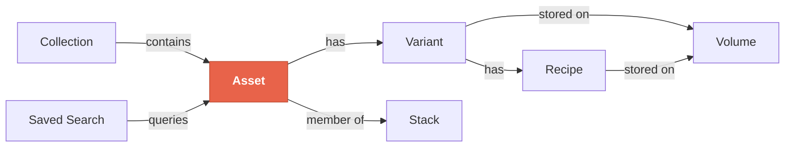
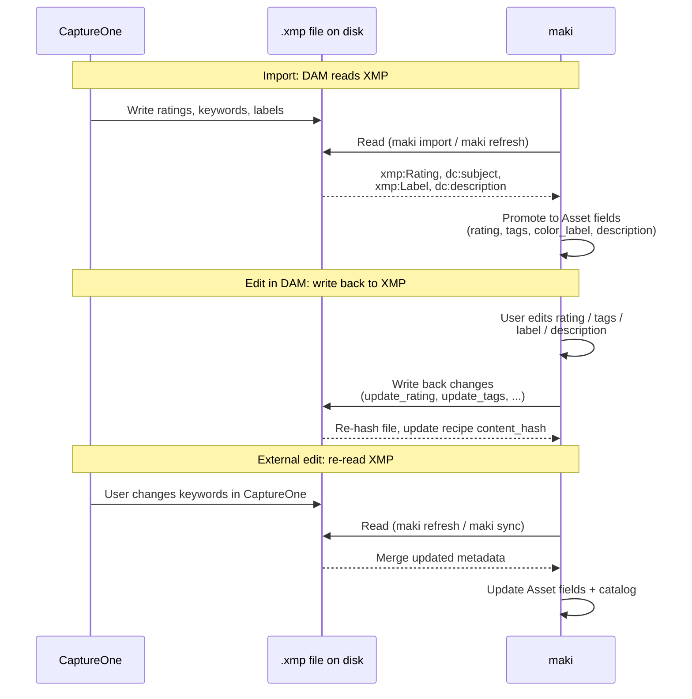
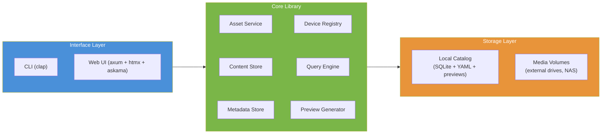
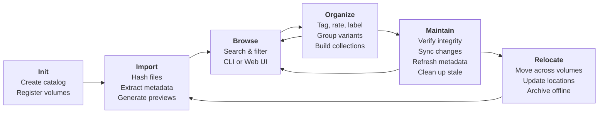

# Overview & Concepts

This chapter introduces the data model, architecture, and workflow of **maki** -- a CLI digital asset manager designed for photographers and media professionals managing large collections (terabytes of images, videos, and processing files) across multiple storage devices.

## Core Concepts

maki organizes your files around these core concepts.



### Asset

The central entity. An Asset represents a single logical image or media item -- "photo of sunset at the beach" -- regardless of how many files exist for it. An Asset has a deterministic UUID derived from the content hash of its first variant, plus optional metadata: name, description, tags (keywords), rating (1--5 stars), and color label (Red, Orange, Yellow, Green, Blue, Pink, Purple -- a superset of Lightroom's palette that matches CaptureOne). Tags support hierarchy using `/` as a separator (e.g., `animals/birds/eagles`); searching for a parent tag matches all descendants.

### Variant

A concrete file belonging to an Asset. A RAW file, its JPEG conversion, and a high-res TIFF export are three Variants of the same Asset. Each Variant is identified by its **SHA-256 content hash** -- the same file always produces the same hash, regardless of where it is stored.

Variants carry a **role** that describes their purpose:

| Role | Meaning |
|------|---------|
| **Original** | Camera original (RAW, in-camera JPEG) |
| **Alternate** | Another original of the same shot (e.g. in-camera JPEG alongside RAW) |
| **Processed** | Intermediate edit (PSD, layered TIFF) |
| **Export** | Final deliverable (resized JPEG, web TIFF) |
| **Sidecar** | Accompanying non-media file |

Each Variant tracks one or more **file locations** -- a volume plus a relative path. A single Variant can exist on multiple drives (copies, backups on a NAS), and maki tracks them all. Each location stores a `verified_at` timestamp from the last integrity check.

### Recipe

A processing sidecar file (`.xmp`, `.cos`, `.cot`, `.cop`, `.pp3`, `.dop`, `.on1`) attached to a Variant. Recipes store edits from tools like CaptureOne, Lightroom, RawTherapee, DxO, and ON1. Unlike Variants, Recipes are identified by **location** (volume + path) rather than content hash, because external tools routinely modify them in place. This means re-importing after an external edit updates the existing Recipe rather than creating a duplicate.

maki reads metadata from Recipes during import (rating, tags, description, color label) and can write changes back to XMP files via `maki writeback` or `maki sync-metadata`.

### Volume

A registered storage device: local disk, external drive, or network share. Each Volume has a human-readable label and a mount point. maki detects online/offline status at runtime, so you can browse and search assets on unmounted drives using cached metadata and preview thumbnails.

### Stack

A group of related but independent assets -- burst shots, exposure brackets, or similar scenes that you want to collapse into a single entry in the browse grid. Each asset can belong to at most one stack. Members are position-ordered; position 0 is the **pick** (the representative image shown when the stack is collapsed). Unlike variants (which merge files into one asset), stacked assets keep their own ratings, tags, and descriptions.

### Collection

A manual album -- a named list of assets you curate by hand. Collections are static: adding or removing assets requires an explicit action. Use collections for portfolios, client deliveries, print selections, or any grouping that doesn't follow a search pattern.

### Saved Search

A smart album -- a named search query that dynamically matches assets. Saved searches appear as quick-access chips in the browse toolbar. When your catalog changes (new imports, rating changes, tag edits), the results update automatically because the query is re-evaluated each time.

## Content-Addressable Storage

Every file imported into maki is hashed with SHA-256. This hash becomes the file's identity:

- **Deduplication**: Importing the same file twice (even from different paths or drives) recognizes it as the same content and adds the new location to the existing Variant rather than creating a duplicate.
- **Integrity verification**: The `verify` command re-hashes files on disk and compares against stored hashes to detect corruption or bit rot.
- **Transparent relocation**: Moving a file to a different drive does not change its identity. The `relocate` and `update-location` commands update the catalog to reflect the new path.

Originals (RAW files, camera JPEGs) are immutable -- their content never changes, so their hash is stable forever. Recipe files are the exception: they are modified by external tools, so maki tracks them by location and updates their stored hash when changes are detected.

## Two-Tier Storage

maki uses a dual-storage architecture. Neither tier alone is sufficient; together they provide both robustness and performance.

**YAML sidecar files** (source of truth): One `.yml` file per Asset, stored in the catalog's `assets/` directory. Contains the complete Asset record: metadata, all Variants, all Recipes, all FileLocations. Human-readable, diffable, and version-control friendly. If the SQLite database is ever lost or corrupted, running `rebuild-catalog` reconstructs it entirely from these files.

**SQLite catalog** (derived cache): A single `catalog.db` file providing fast indexed queries. Contains denormalized columns for efficient browse-grid rendering (best variant hash, primary format, variant count). The catalog is always rebuildable from sidecars -- it is a performance optimization, not a source of truth.

This design means you never lose data from a database corruption event. The YAML sidecars are the authoritative record.

## Multi-Volume Support

Real-world photo libraries span multiple storage devices: a fast internal SSD for current projects, external drives for archives, a NAS for backups. maki handles this natively:

- **Register volumes** with `maki volume add` -- give each drive a label and mount point.
- **Import from any volume** -- maki auto-detects which registered volume a file path belongs to and stores a volume-relative path.
- **Offline browsing** -- when a drive is unmounted, its assets remain searchable and browsable via cached metadata and preview thumbnails in the local catalog.
- **Cross-volume operations** -- `relocate` copies or moves assets between volumes, `verify` checks file integrity across all online volumes, and `cleanup` detects missing files on online volumes.

See [Setup](02-setup.md) for volume registration and [Maintenance](07-maintenance.md) for cross-volume operations.

## Variant Grouping

During import, maki automatically groups related files into a single Asset using **stem-based matching**: files that share the same filename stem in the same directory are grouped together.

For example, importing a directory containing:

```
DSC_4521.NEF       --> Original variant (RAW)
DSC_4521.jpg       --> Original variant (JPEG)
DSC_4521.xmp       --> Recipe (attached to NEF variant)
```

produces one Asset with two Variants and one Recipe. The RAW file takes priority as the primary variant (defining the asset's identity, EXIF metadata, and deterministic UUID).

For files that end up in different directories -- common with CaptureOne exports that land in an `output/` subfolder -- the `auto-group` command performs **fuzzy prefix matching** across the entire catalog. It matches stems like `DSC_4521` and `DSC_4521-1-HighRes` by checking that the shorter stem is a prefix of the longer one and the next character is a non-alphanumeric separator (`-`, `_`, space, `(`).

See [Ingesting Assets](03-ingest.md) for import details and [Organizing Assets](04-organize.md) for manual and automatic grouping.

## Bidirectional XMP Sync

maki maintains two-way synchronization with `.xmp` sidecar files, enabling a round-trip workflow with tools like CaptureOne and Lightroom.



**DAM to disk**: When you change a rating, tag, description, or color label via the CLI (`maki edit`, `maki tag`) or the web UI, maki writes the change back to any associated `.xmp` files on disk, then re-hashes them and updates the stored recipe hash.

**Disk to DAM**: When CaptureOne or another tool modifies an `.xmp` file, running `maki refresh` or `maki sync` detects the changed hash, re-extracts the XMP metadata, and updates the Asset in both the catalog and sidecar YAML.

Tags added independently in CaptureOne are preserved during write-back -- maki uses operation-level deltas (add/remove specific tags) rather than overwriting the entire tag list.

See [Ingesting Assets](03-ingest.md) for XMP extraction during import and [Maintenance](07-maintenance.md) for the `refresh` and `sync` commands.

## Architecture

maki is structured in three layers.



### Interface Layer

**CLI** (clap): Subcommand-based interface (`maki import`, `maki search`, `maki serve`, etc.). Supports `--json` for machine-readable output, `--log` for per-file progress, `--format` for custom output templates.

**Web UI** (axum + htmx + askama): Browser-based interface started with `maki serve`. Provides a browse grid with filters, inline editing, batch operations, and keyboard navigation. Uses htmx for partial page updates without a JavaScript framework.

### Core Library

| Component | Responsibility |
|-----------|----------------|
| **Asset Service** | Orchestrates import, grouping, relocation, verification, preview generation |
| **Content Store** | SHA-256 hashing, deduplication, hash-to-location mapping |
| **Metadata Store** | YAML sidecar read/write, the authoritative data layer |
| **Device Registry** | Volume tracking, mount point detection, online/offline status |
| **Query Engine** | SQLite search, metadata editing (tags, rating, label), auto-grouping |
| **Preview Generator** | Thumbnail creation via `image` crate, `dcraw`/LibRaw (RAW), `ffmpeg` (video) |

Additional modules handle EXIF extraction, XMP reading/writing, configuration parsing (`maki.toml`), output formatting, and collection/saved-search management.

### Storage Layer

**Local Catalog** (always available on local disk):

- `catalog.db` -- SQLite database (derived index, rebuildable)
- `assets/` -- YAML sidecar files (source of truth)
- `previews/` -- JPEG thumbnails for offline browsing
- `volumes.yaml` -- registered volume definitions
- `searches.toml` -- saved searches
- `collections.yaml` -- static album definitions
- `stacks.yaml` -- stack definitions (member order and pick)
- `maki.toml` -- configuration

**Media Volumes** (may be offline): The actual asset files on external drives, NAS, or local directories. maki never moves or modifies original media files unless explicitly asked (via `relocate --remove-source`).

## Preview Generation

maki generates preview thumbnails (800px JPEG by default) for each variant during import, enabling offline browsing even when media volumes are unmounted. Optionally, high-resolution smart previews (2560px) can be generated alongside thumbnails for zoom and pan in the web UI lightbox — enable with `maki import --smart` or `[import] smart_previews = true` in `maki.toml`. Different file types use different strategies:

| File type | Strategy |
|-----------|----------|
| Standard images (JPEG, PNG, TIFF, WebP) | `image` crate (native Rust) |
| RAW files (NEF, ARW, CR3, ...) | `dcraw` or `dcraw_emu` (LibRaw) |
| Video files (MP4, MOV, ...) | `ffmpeg` (frame extraction) |
| Audio, documents, other | Info card (metadata summary rendered as JPEG) |

Preview failure never blocks import. If an external tool is missing, an info card is generated as a fallback.

The display logic prefers Export > Processed > Original variant previews, with standard image formats preferred over RAW within the same role. This means your best-quality deliverable is shown in the browse grid, not the camera original.

Preview settings (max edge size, format, quality) are configurable in `maki.toml`. See [Setup](02-setup.md) for configuration details and [Ingesting Assets](03-ingest.md) for the `generate-previews` command.

## Collections, Stacks, and Saved Searches

maki provides three ways to organize assets into groups:

**Collections** (static albums): Manually curated lists of asset IDs. You explicitly add and remove assets. Backed by both SQLite (for fast queries) and a `collections.yaml` file (for persistence across catalog rebuilds). Use these for curated sets like "Portfolio" or "Client Deliverables".

**Stacks**: Lightweight anonymous groups for burst shots, bracketing, or similar scenes. The browse grid collapses each stack to show only the pick image with a count badge, reducing visual clutter. Backed by a `stacks.yaml` file for persistence across catalog rebuilds. Use these to declutter the browse grid without permanently merging variants.

**Saved searches** (smart albums): Named queries stored in `searches.toml`. A saved search is a set of filter criteria (tags, rating, date range, volume, etc.) that is re-evaluated every time you run it. Results update automatically as your catalog changes. Use these for dynamic views like "5-star landscapes" or "untagged imports from last week".

All three are accessible from the CLI and the web UI. See [Organizing Assets](04-organize.md) for detailed usage.

\newpage

## The Round-Trip Workflow

A typical maki workflow follows this cycle:



1. **Init** -- Create a catalog directory and register your storage volumes. See [Setup](02-setup.md).
2. **Import** -- Point maki at directories of files. It hashes everything, extracts EXIF/XMP metadata, groups related files into Assets, generates preview thumbnails, and builds the catalog. See [Ingesting Assets](03-ingest.md).
3. **Browse** -- Search and filter your catalog by tags, rating, color label, camera, date, format, volume, path, collection, or free text. Use the CLI for scripting or the web UI for visual browsing. See [Browsing & Searching](05-browse-and-search.md) and [Web UI](06-web-ui.md).
4. **Organize** -- Add tags, set ratings and color labels, write descriptions, group variants, build collections, and save searches. Changes write back to XMP files for interoperability. See [Organizing Assets](04-organize.md).
5. **Maintain** -- Verify file integrity against stored hashes, sync the catalog with disk after external tools move or rename files, refresh metadata from modified XMP sidecars, and clean up stale location records. See [Maintenance](07-maintenance.md).
6. **Relocate** -- Copy or move assets between volumes (external drives, NAS, archive storage). Update location records after manual file moves. The cycle continues as you import new work or re-process existing assets.

Each step is covered in detail in the following chapters.

---

Next: [Setup](02-setup.md) -- Installation, catalog initialization, volume registration, and configuration.
