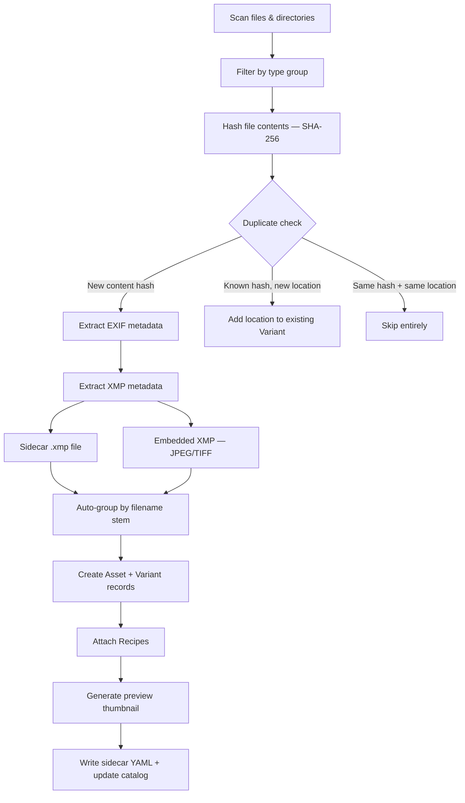

# Ingesting Assets

Importing is how files enter the dam catalog. Unlike traditional asset managers that copy files into a managed library folder, dam catalogs files **in place** on your existing volumes. The import process hashes each file (SHA-256), extracts metadata, generates previews, and records everything in the catalog -- but your originals stay exactly where they are.

## Import Pipeline

The following diagram shows the stages a file passes through during import:



**Metadata precedence**: When the same field appears in multiple sources, EXIF wins over embedded XMP, which wins over sidecar XMP. Tags (keywords) are merged from all sources as a union.

## Basic Import

Import a directory of photos:

```
dam import /Volumes/PhotosDrive/Photos/2026-02-20/
```

Import specific files:

```
dam import /Volumes/PhotosDrive/DSC_0042.nef /Volumes/PhotosDrive/DSC_0043.nef
```

The path you provide must reside on a [registered volume](02-setup.md). dam resolves the volume automatically from the file path. If auto-detection picks the wrong volume (for example, when mount points are nested), specify it explicitly:

```
dam import --volume "Photos 2024" /path/to/files
```

### Preview Before Committing

Use `--dry-run` to see what would happen without writing anything to the catalog:

```
dam import --dry-run /Volumes/PhotosDrive/Photos/2026-02-20/
```

Files are still hashed during a dry run (so duplicate detection works), but no assets, variants, recipes, or previews are created. The output shows the same counters as a real import:

```
Dry run — would import: 47 imported, 3 skipped, 2 locations added, 5 recipes attached
```

Add `--json` for structured output (includes a `dry_run: true` field) or `--log` to see per-file details.

### What Import Does NOT Do

Import does not copy or move your files. The catalog stores references to files on their volumes. This means:

- Your directory structure stays intact.
- Files are not renamed or reorganized.
- The same file can be cataloged from multiple volumes (e.g., original drive and a backup).
- If a volume is disconnected, the catalog remembers the files but marks the volume as offline.

## Auto-Grouping

When dam imports a directory, it groups files by **filename stem** -- the filename without its extension. Files sharing the same stem in the same directory become a single Asset with multiple Variants.

### How It Works

Consider a directory containing:

```
DSC_0042.nef
DSC_0042.jpg
DSC_0042.xmp
```

dam creates **one Asset** with:

| File | Role | Record Type |
|---|---|---|
| `DSC_0042.nef` | Original (primary) | Variant |
| `DSC_0042.jpg` | Extra variant | Variant |
| `DSC_0042.xmp` | Processing sidecar | Recipe |

RAW files always take priority as the primary variant because they represent the original capture. The primary variant defines the asset's identity and provides the authoritative EXIF data.

### Practical Example

A typical CaptureOne session directory might contain:

```
Z91_8561.ARW          # RAW original
Z91_8561.ARW.xmp      # XMP sidecar from CaptureOne
Z91_8561.ARW.cos      # CaptureOne settings
Z91_8561.jpg          # JPEG export
```

After import:

```
dam show <asset-id>
```

```
Asset: Z91_8561
  Variant 1 (Original): Z91_8561.ARW [abc123...]
  Variant 2 (Export):    Z91_8561.jpg [def456...]
  Recipe 1: Z91_8561.ARW.xmp
  Recipe 2: Z91_8561.ARW.cos
```

For more advanced grouping across different directories or after the fact, see the [auto-group command](04-organize.md) and [group command](04-organize.md).

### Cross-Directory Grouping with --auto-group

Standard auto-grouping only matches files within the same directory. But photo tools like CaptureOne often place RAW originals and exports in separate folders:

```
2026-02-22/
  Capture/
    DSC_0042.ARW
  Output/
    DSC_0042.JPG
    DSC_0042-1-HighRes.tif
```

Without `--auto-group`, importing both directories creates separate assets for the RAW and exports. The `--auto-group` flag runs a post-import grouping step scoped to the "neighborhood" of the imported files:

```
dam import --auto-group /Volumes/Photos/2026-02-22/Capture /Volumes/Photos/2026-02-22/Output
```

```
Import complete: 3 imported, 1 recipe(s) attached, 3 preview(s) generated
Auto-group: 1 stem group(s), 2 donor(s) merged, 2 variant(s) moved
```

**How the neighborhood is determined**: For each imported file's directory (e.g., `2026-02-22/Capture/`), dam goes up one level to find the "session root" (`2026-02-22/`). It then searches the catalog for all assets under those session roots on the same volume. Only those assets participate in grouping.

This scoping prevents false positives from restarting camera counters -- `DSC_0001` from a January shoot won't be grouped with `DSC_0001` from a June shoot because they live under different session roots.

**Incremental workflow**: You can also use `--auto-group` when adding exports to a previously imported shoot:

```
# First import: RAW originals only
dam import /Volumes/Photos/2026-02-22/Capture

# Later: CaptureOne exports are ready
dam import --auto-group /Volumes/Photos/2026-02-22/Output
```

The second import detects the existing RAW assets in the sibling `Capture/` directory and groups the exports with them.

Combine with `--dry-run` to preview what would be grouped without making changes:

```
dam import --auto-group --dry-run /Volumes/Photos/2026-02-22/Capture /Volumes/Photos/2026-02-22/Output
```

## Recipe Handling

Processing sidecars are files created by RAW processors and image editors to store non-destructive edit settings. dam recognizes the following recipe formats:

| Extension | Tool |
|---|---|
| `.xmp` | Adobe Lightroom, CaptureOne, generic XMP |
| `.cos`, `.cot`, `.cop` | CaptureOne sessions/catalogs |
| `.pp3` | RawTherapee |
| `.dop` | DxO PhotoLab |
| `.on1` | ON1 Photo RAW |

### Attachment Rules

Recipes are attached to the **primary variant** of the matching asset (matched by filename stem in the same directory). They are identified by **location** (volume + path), not by content hash. This is an important distinction:

- If you edit settings in CaptureOne and re-import, dam updates the existing recipe record rather than creating a duplicate.
- The recipe's content hash is updated to reflect the new file contents.

### Standalone Recipe Resolution

You can import recipe files after their media files:

```
# First import: RAW files
dam import /Volumes/PhotosDrive/Shoot/

# Later: CaptureOne creates XMP sidecars
dam import /Volumes/PhotosDrive/Shoot/*.xmp
```

dam finds the parent variant by matching the filename stem and directory, then attaches the recipe to it.

### Enabling Non-Default Recipe Groups

By default, only `.xmp` recipe files are imported. CaptureOne, RawTherapee, DxO, and ON1 sidecars require opting in:

```
dam import --include captureone /Volumes/PhotosDrive/Shoot/
dam import --include captureone --include rawtherapee /Volumes/PhotosDrive/Shoot/
```

See [Import Options](#import-options) below for the full list of type groups.

## Metadata Extraction

dam extracts metadata from three sources during import, each contributing different information about the asset.

### EXIF Data

Extracted directly from image files (RAW, JPEG, TIFF). Provides camera and capture information:

- Camera make and model
- Lens
- ISO, aperture, shutter speed, focal length
- Image dimensions
- Capture date and time
- GPS coordinates (if present)

EXIF data is stored in the variant's `source_metadata` and used to populate the asset's `captured_at` timestamp.

### XMP Sidecar Files

When an `.xmp` file is attached as a recipe, its contents are parsed and merged into the asset:

| XMP Field | dam Field | Notes |
|---|---|---|
| `dc:subject` | Tags | Merged with existing tags (union) |
| `dc:description` | Description | Set if not already present |
| `xmp:Rating` | Rating | Integer 1-5 |
| `xmp:Label` | Color label | Red, Orange, Yellow, Green, Blue, Pink, Purple |
| `dc:creator` | Source metadata | Stored as `creator` |
| `dc:rights` | Source metadata | Stored as `rights` |

### Embedded XMP

JPEG and TIFF files can contain XMP metadata embedded in their binary structure (APP1 marker for JPEG, IFD tag 700 for TIFF). dam extracts the same fields as from sidecar XMP. This captures keywords, ratings, and labels from tools like CaptureOne and Lightroom that embed XMP directly in exported files.

Other file formats (RAW, video, audio, etc.) are skipped for embedded XMP extraction -- zero I/O overhead.

### Precedence Chain

When the same metadata field is available from multiple sources:

```
EXIF  >  Embedded XMP  >  Sidecar XMP
(highest)               (lowest)
```

- **EXIF** values are assigned directly and always win.
- **Embedded XMP** values use insert-if-absent semantics.
- **Sidecar XMP** values use insert-if-absent semantics.
- **Tags** are the exception: all sources merge (union of all keywords).

For description, rating, and color label, the first source that provides a value wins.

## Preview Generation

dam generates preview thumbnails during import so you can browse assets without accessing the original files.

### By File Type

| File type | Method | Result |
|---|---|---|
| Standard images (JPEG, PNG, TIFF, WebP, etc.) | `image` crate | 800px JPEG thumbnail |
| RAW files (NEF, ARW, CR3, DNG, etc.) | `dcraw` or `dcraw_emu` (LibRaw) | 800px JPEG thumbnail |
| Video (MP4, MOV, MKV, etc.) | `ffmpeg` frame extraction | 800px JPEG thumbnail |
| Audio, documents, unknown | Info card renderer | 800x600 JPEG with file metadata |

The maximum edge size (default 800px) and output format (JPEG or WebP) are configurable in `dam.toml`:

```toml
[preview]
max_edge = 1200
format = "jpeg"
quality = 85
```

### Info Cards

When a file has no visual preview (audio files, documents) or when external tools (`dcraw`, `ffmpeg`) are not installed, dam generates an **info card** -- an 800x600 JPEG displaying the file's metadata:

- Filename and format
- File size
- For audio: duration, bitrate, sample rate (extracted via the `lofty` crate)

### Storage and Failure

Previews are stored under the catalog's `previews/` directory:

```
previews/
  ab/
    ab3f7c9e2d...1a4b.jpg
  f2/
    f29a4bc81e...7d3c.jpg
```

The first two characters of the content hash serve as a subdirectory prefix to avoid having too many files in a single directory.

**Preview generation never blocks import.** If `dcraw` is missing, a RAW file still imports successfully -- it just gets an info card instead of a rendered preview. You can regenerate previews later with `dam generate-previews`.

## Import Options

### File Type Groups

dam organizes recognized file extensions into groups. Some are enabled by default; others require opting in.

| Group | Extensions | Default |
|---|---|---|
| `images` | jpg, jpeg, png, gif, bmp, tiff, tif, webp, heic, heif, svg, ico, psd, xcf, raw, cr2, cr3, nef, arw, orf, rw2, dng, raf, pef, srw | On |
| `video` | mp4, mov, avi, mkv, wmv, flv, webm, m4v, mpg, mpeg, 3gp, mts, m2ts | On |
| `audio` | mp3, wav, flac, aac, ogg, wma, m4a, aiff, alac | On |
| `xmp` | xmp | On |
| `documents` | pdf, doc, docx, xls, xlsx, ppt, pptx, txt, md, rtf, csv, json, xml, html, htm | Off |
| `captureone` | cos, cot, cop | Off |
| `rawtherapee` | pp3 | Off |
| `dxo` | dop | Off |
| `on1` | on1 | Off |

Enable additional groups with `--include`, disable default groups with `--skip`:

```
# Import photos plus CaptureOne sidecars, but skip audio files
dam import --include captureone --skip audio /Volumes/PhotosDrive/Shoot/
```

### Exclude Patterns

Configure glob patterns in `dam.toml` to permanently exclude files by name:

```toml
[import]
exclude = ["Thumbs.db", "*.tmp", ".DS_Store"]
```

### Auto-Tags

Apply tags automatically to every newly imported asset:

```toml
[import]
auto_tags = ["inbox", "unreviewed"]
```

Auto-tags are merged with any tags extracted from XMP metadata (deduplicated).

### All Flags

| Flag | Effect |
|---|---|
| `--volume <label>` | Use a specific volume instead of auto-detecting from the file path |
| `--dry-run` | Show what would happen without writing to catalog, sidecar, or disk |
| `--auto-group` | After import, group new assets with nearby catalog assets by filename stem |
| `--include <group>` | Enable an additional file type group (repeatable) |
| `--skip <group>` | Disable a default file type group (repeatable) |
| `--json` | Structured JSON output to stdout |
| `--log` | Per-file progress to stderr (`filename -- status (duration)`) |
| `--time` | Show total elapsed time |

## Duplicate Handling

dam uses content hashing (SHA-256) to detect duplicates at the file level.

### Three Outcomes

When importing a file, one of three things happens:

1. **New content hash** -- The file is new to the catalog. A new Variant is created (and potentially a new Asset).

2. **Known hash, new location** -- The file's content already exists in the catalog, but this is a new path (perhaps on a different volume, or the file was copied to a new directory). The new location is **added** to the existing Variant. The asset is not duplicated.

3. **Same hash and same location** -- Both the content and the path are already recorded. The file is truly skipped.

### Example: Backup Drive

```
# Import from primary drive
dam import /Volumes/Photos/Shoot-2026-02-20/

# Later, import the same files from a backup
dam import /Volumes/Backup/Shoot-2026-02-20/
```

The second import adds backup locations to the existing variants. Each variant now has two file locations (one per volume), but the catalog contains only one copy of each asset.

### Finding Duplicates

Use `dam duplicates` to find files with identical content across locations:

```
dam duplicates
```

```
abc3f7c9...  DSC_0042.nef
  /Volumes/Photos/Shoot-2026-02-20/DSC_0042.nef
  /Volumes/Backup/Shoot-2026-02-20/DSC_0042.nef
```

This is useful for identifying redundant copies, verifying backups, or cleaning up after file reorganization. See the [maintenance chapter](07-maintenance.md) for more on managing file locations.

---

Next: [Organizing Assets](04-organize.md) -- tags, ratings, labels, grouping, collections, and saved searches.
