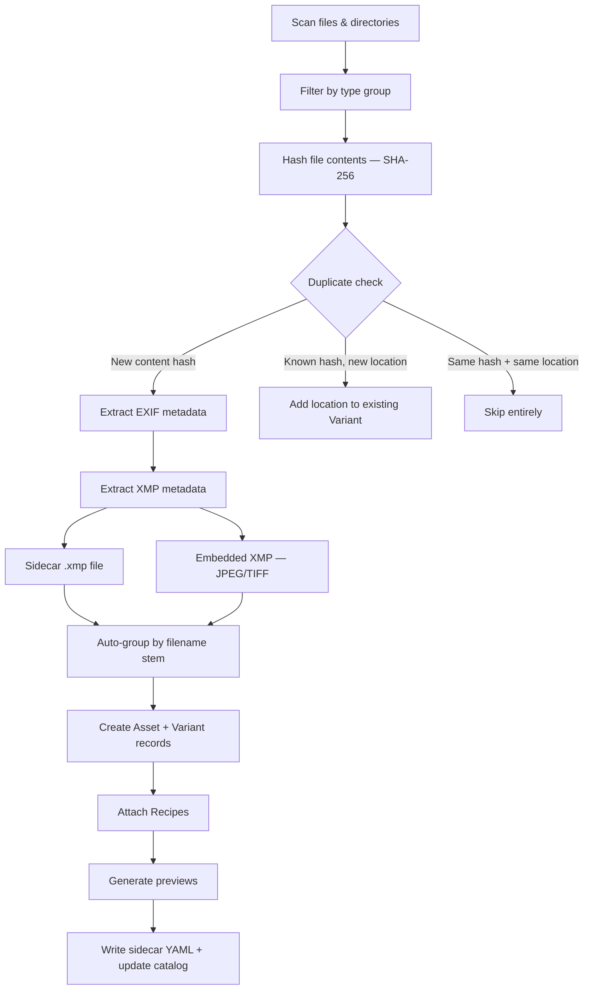

# Ingesting Assets

Importing is how files enter the maki catalog. Unlike traditional asset managers that copy files into a managed library folder, maki catalogs files **in place** on your existing volumes. The import process hashes each file (SHA-256), extracts metadata, generates previews, and records everything in the catalog -- but your originals stay exactly where they are.

## Import Pipeline

The following diagram shows the stages a file passes through during import:



**Metadata precedence**: On initial import, fields are set by the first source that provides them: EXIF data is extracted first, then embedded XMP fills any remaining empty fields, then sidecar XMP fills what is still unset. Tags (keywords) are merged from all sources as a union. On subsequent recipe updates (e.g. after editing in Capture One or Lightroom), sidecar XMP takes highest precedence and overwrites rating, description, and color label. The `created_at` date is always derived from EXIF and never overwritten by XMP.

## Basic Import

Import a directory of photos:

```
maki import /Volumes/PhotosDrive/Photos/2026-02-20/
```

Import specific files:

```
maki import /Volumes/PhotosDrive/DSC_0042.nef /Volumes/PhotosDrive/DSC_0043.nef
```

The path you provide must reside on a [registered volume](02-setup.md). maki resolves the volume automatically from the file path. If auto-detection picks the wrong volume (for example, when mount points are nested), specify it explicitly:

```
maki import --volume "Photos 2024" /path/to/files
```

### Preview Before Committing

Use `--dry-run` to see what would happen without writing anything to the catalog:

```
maki import --dry-run /Volumes/PhotosDrive/Photos/2026-02-20/
```

Files are still hashed during a dry run (so duplicate detection works), but no assets, variants, recipes, or previews are created. The output shows the same counters as a real import:

```
Dry run — would import: 47 imported, 3 skipped, 2 locations added, 5 recipes attached
```

Add `--json` for structured output (includes a `dry_run: true` field) or `--log` to see per-file details.

### What Import Does NOT Do

Import does not copy or move your files. The catalog stores references to files on their volumes. This means:

- Your directory structure stays intact.
- Files are not renamed or reorganized.
- The same file can be cataloged from multiple volumes (e.g., original drive and a backup).
- If a volume is disconnected, the catalog remembers the files but marks the volume as offline.

## Auto-Grouping

When maki imports a directory, it groups files by **filename stem** -- the filename without its extension. Files sharing the same stem in the same directory become a single Asset with multiple Variants.

### How It Works

Consider a directory containing:

```
DSC_0042.nef
DSC_0042.jpg
DSC_0042.xmp
```

maki creates **one Asset** with:

| File | Role | Record Type |
|---|---|---|
| `DSC_0042.nef` | Original (primary) | Variant |
| `DSC_0042.jpg` | Alternate variant | Variant |
| `DSC_0042.xmp` | Processing sidecar | Recipe |

RAW files always take priority as the primary variant because they represent the original capture. The primary variant defines the asset's identity and provides the authoritative EXIF data.

### Practical Example

A typical CaptureOne session directory might contain:

```
Z91_8561.ARW          # RAW original
Z91_8561.ARW.xmp      # XMP sidecar from CaptureOne
Z91_8561.ARW.cos      # CaptureOne settings
Z91_8561.jpg          # JPEG export
```

After import:

```
maki show <asset-id>
```

```
Asset: Z91_8561
  Variant 1 (Original): Z91_8561.ARW [abc123...]
  Variant 2 (Alternate): Z91_8561.jpg [def456...]
  Recipe 1: Z91_8561.ARW.xmp
  Recipe 2: Z91_8561.ARW.cos
```

For more advanced grouping across different directories or after the fact, see the [auto-group command](04-organize.md) and [group command](04-organize.md).

### Cross-Directory Grouping with --auto-group

Standard auto-grouping only matches files within the same directory. But photo tools like CaptureOne often place RAW originals and exports in separate folders:

```
2026-02-22/
  Capture/
    DSC_0042.ARW
  Output/
    DSC_0042.JPG
    DSC_0042-1-HighRes.tif
```

Without `--auto-group`, importing both directories creates separate assets for the RAW and exports. The `--auto-group` flag runs a post-import grouping step scoped to the "neighborhood" of the imported files:

```
maki import --auto-group /Volumes/Photos/2026-02-22/Capture /Volumes/Photos/2026-02-22/Output
```

```
Import complete: 3 imported, 1 recipe(s) attached, 3 preview(s) generated
Auto-group: 1 stem group(s), 2 donor(s) merged, 2 variant(s) moved
```

**How the neighborhood is determined**: For each imported file's directory (e.g., `2026-02-22/Capture/`), maki goes up one level to find the "session root" (`2026-02-22/`). It then searches the catalog for all assets under those session roots on the same volume. Only those assets participate in grouping.

This scoping prevents false positives from restarting camera counters -- `DSC_0001` from a January shoot won't be grouped with `DSC_0001` from a June shoot because they live under different session roots.

**Incremental workflow**: You can also use `--auto-group` when adding exports to a previously imported shoot:

```
# First import: RAW originals only
maki import /Volumes/Photos/2026-02-22/Capture

# Later: CaptureOne exports are ready
maki import --auto-group /Volumes/Photos/2026-02-22/Output
```

The second import detects the existing RAW assets in the sibling `Capture/` directory and groups the exports with them.

Combine with `--dry-run` to preview what would be grouped without making changes:

```
maki import --auto-group --dry-run /Volumes/Photos/2026-02-22/Capture /Volumes/Photos/2026-02-22/Output
```

## Recipe Handling

Processing sidecars are files created by RAW processors and image editors to store non-destructive edit settings. maki recognizes the following recipe formats:

| Extension | Tool |
|---|---|
| `.xmp` | Adobe Lightroom, CaptureOne, generic XMP |
| `.cos`, `.cot`, `.cop` | CaptureOne sessions/catalogs |
| `.pp3` | RawTherapee |
| `.dop` | DxO PhotoLab |
| `.on1` | ON1 Photo RAW |

### Attachment Rules

Recipes are attached to the **primary variant** of the matching asset (matched by filename stem in the same directory). They are identified by **location** (volume + path), not by content hash. This is an important distinction:

- If you edit settings in CaptureOne and re-import, maki updates the existing recipe record rather than creating a duplicate.
- The recipe's content hash is updated to reflect the new file contents.

### Standalone Recipe Resolution

You can import recipe files after their media files:

```
# First import: RAW files
maki import /Volumes/PhotosDrive/Shoot/

# Later: CaptureOne creates XMP sidecars
maki import /Volumes/PhotosDrive/Shoot/*.xmp
```

maki finds the parent variant by matching the filename stem and directory, then attaches the recipe to it.

### Enabling Non-Default Recipe Groups

By default, only `.xmp` recipe files are imported. CaptureOne, RawTherapee, DxO, and ON1 sidecars require opting in:

```
maki import --include captureone /Volumes/PhotosDrive/Shoot/
maki import --include captureone --include rawtherapee /Volumes/PhotosDrive/Shoot/
```

See [Import Options](#import-options) below for the full list of type groups.

## Metadata Extraction

maki extracts metadata from three sources during import, each contributing different information about the asset.

### EXIF Data

Extracted directly from image files (RAW, JPEG, TIFF). Provides camera and capture information:

- Camera make and model
- Lens
- ISO, aperture, shutter speed, focal length
- Image dimensions
- Capture date and time
- GPS coordinates (if present)

EXIF data is stored in the variant's `source_metadata` and used to populate the asset's `captured_at` timestamp.

### XMP Sidecar Files

When an `.xmp` file is attached as a recipe, its contents are parsed and merged into the asset:

| XMP Field | maki Field | Notes |
|---|---|---|
| `dc:subject` | Tags | Merged with existing tags (union) |
| `dc:description` | Description | Set if not already present |
| `xmp:Rating` | Rating | Integer 1-5 |
| `xmp:Label` | Color label | Red, Orange, Yellow, Green, Blue, Pink, Purple |
| `dc:creator` | Source metadata | Stored as `creator` |
| `dc:rights` | Source metadata | Stored as `rights` |

### Embedded XMP

JPEG and TIFF files can contain XMP metadata embedded in their binary structure (APP1 marker for JPEG, IFD tag 700 for TIFF). maki extracts the same fields as from sidecar XMP. This captures keywords, ratings, and labels from tools like CaptureOne and Lightroom that embed XMP directly in exported files.

Other file formats (RAW, video, audio, etc.) are skipped for embedded XMP extraction -- zero I/O overhead.

### Processing Order and Precedence

Metadata sources are processed in this order during import:

1. **EXIF** — extracted first. Sets `created_at`, camera/lens info, exposure data, GPS coordinates.
2. **Embedded XMP** (JPEG/TIFF only) — fills any fields still empty after EXIF (insert-if-absent).
3. **Sidecar XMP** — fills any fields still empty after embedded XMP (insert-if-absent).

For rating, description, and color label, the **first source to set a value wins** on initial import. Tags are always merged from all sources (union of all keywords, no removal).

When a sidecar recipe is **updated later** (e.g. after editing in Capture One or Lightroom), the behavior changes: sidecar XMP **overwrites** rating, description, and color label. This ensures that edits made in photo editing software take effect. The `created_at` date is never overwritten — it is always derived from EXIF.

## Preview Generation

maki generates preview thumbnails during import so you can browse assets without accessing the original files. Optionally, high-resolution **smart previews** (2560px) can be generated alongside thumbnails, enabling zoom and pan in the web UI lightbox.

### By File Type

| File type | Method | Result |
|---|---|---|
| Standard images (JPEG, PNG, TIFF, WebP, etc.) | `image` crate | 800px JPEG thumbnail |
| RAW files (NEF, ARW, CR3, DNG, etc.) | `dcraw` or `dcraw_emu` (LibRaw) | 800px JPEG thumbnail |
| Video (MP4, MOV, MKV, etc.) | `ffmpeg` frame extraction | 800px JPEG thumbnail |
| Audio, documents, unknown | Info card renderer | 800x600 JPEG with file metadata |

The maximum edge size (default 800px) and output format (JPEG or WebP) are configurable in `maki.toml`. Smart previews have separate size and quality settings:

```toml
[preview]
max_edge = 800          # regular thumbnail max edge (default 800)
format = "jpeg"         # jpeg or webp
quality = 85            # JPEG/WebP quality (1-100)
smart_max_edge = 2560   # smart preview max edge (default 2560)
smart_quality = 92      # smart preview quality (default 92)
```

To generate smart previews during import, use `--smart` or enable permanently:

```toml
[import]
smart_previews = true
```

### Info Cards

When a file has no visual preview (audio files, documents) or when external tools (`dcraw`, `ffmpeg`) are not installed, maki generates an **info card** -- an 800x600 JPEG displaying the file's metadata:

- Filename and format
- File size
- For audio: duration, bitrate, sample rate (extracted via the `lofty` crate)

### Storage and Failure

Previews are stored under the catalog's `previews/` and `smart_previews/` directories:

```
previews/
  ab/
    ab3f7c9e2d...1a4b.jpg
  f2/
    f29a4bc81e...7d3c.jpg
smart_previews/
  ab/
    ab3f7c9e2d...1a4b.jpg
  f2/
    f29a4bc81e...7d3c.jpg
```

The first two characters of the content hash serve as a subdirectory prefix to avoid having too many files in a single directory. Smart previews use the same naming scheme in a separate directory.

**Preview generation never blocks import.** If `dcraw` is missing, a RAW file still imports successfully -- it just gets an info card instead of a rendered preview. You can regenerate previews later with `maki generate-previews`.

## Import Options

### File Type Groups

maki organizes recognized file extensions into groups. Some are enabled by default; others require opting in.

| Group | Extensions | Default |
|---|---|---|
| `images` | jpg, jpeg, png, gif, bmp, tiff, tif, webp, heic, heif, svg, ico, psd, xcf, raw, cr2, cr3, crw, nef, nrw, arw, sr2, srf, orf, rw2, dng, raf, pef, srw, mrw, 3fr, fff, iiq, erf, kdc, dcr, mef, mos, rwl, bay, x3f | On |
| `video` | mp4, mov, avi, mkv, wmv, flv, webm, m4v, mpg, mpeg, 3gp, mts, m2ts | On |
| `audio` | mp3, wav, flac, aac, ogg, wma, m4a, aiff, alac | On |
| `xmp` | xmp | On |
| `documents` | pdf, doc, docx, xls, xlsx, ppt, pptx, txt, md, rtf, csv, json, xml, html, htm | Off |
| `captureone` | cos, cot, cop | Off |
| `rawtherapee` | pp3 | Off |
| `dxo` | dop | Off |
| `on1` | on1 | Off |

Enable additional groups with `--include`, disable default groups with `--skip`:

```
# Import photos plus CaptureOne sidecars, but skip audio files
maki import --include captureone --skip audio /Volumes/PhotosDrive/Shoot/
```

### Exclude Patterns

Configure glob patterns in `maki.toml` to permanently exclude files by name:

```toml
[import]
exclude = ["Thumbs.db", "*.tmp", ".DS_Store"]
```

### Auto-Tags

Apply tags automatically to every newly imported asset:

```toml
[import]
auto_tags = ["inbox", "unreviewed"]
```

Auto-tags are merged with any tags extracted from XMP metadata (deduplicated).

### All Flags

| Flag | Effect |
|---|---|
| `--volume <label>` | Use a specific volume instead of auto-detecting from the file path |
| `--dry-run` | Show what would happen without writing to catalog, sidecar, or disk |
| `--auto-group` | After import, group new assets with nearby catalog assets by filename stem |
| `--include <group>` | Enable an additional file type group (repeatable) |
| `--skip <group>` | Disable a default file type group (repeatable) |
| `--smart` | Generate smart previews (2560px) for zoom/pan in the web UI |
| `--embed` | Generate image embeddings for visual similarity search (requires `--features ai`) |
| `--json` | Structured JSON output to stdout |
| `--log` | Per-file progress to stderr (`filename -- status (duration)`) |
| `--time` | Show total elapsed time |

## Duplicate Handling

maki uses content hashing (SHA-256) to detect duplicates at the file level.

### Three Outcomes

When importing a file, one of three things happens:

1. **New content hash** -- The file is new to the catalog. A new Variant is created (and potentially a new Asset).

2. **Known hash, new location** -- The file's content already exists in the catalog, but this is a new path (perhaps on a different volume, or the file was copied to a new directory). The new location is **added** to the existing Variant. The asset is not duplicated.

3. **Same hash and same location** -- Both the content and the path are already recorded. The file is truly skipped.

### Example: Backup Drive

```
# Import from primary drive
maki import /Volumes/Photos/Shoot-2026-02-20/

# Later, import the same files from a backup
maki import /Volumes/Backup/Shoot-2026-02-20/
```

The second import adds backup locations to the existing variants. Each variant now has two file locations (one per volume), but the catalog contains only one copy of each asset.

### Finding Duplicates

Use `maki duplicates` to find files with identical content across locations:

```
maki duplicates
```

```
abc3f7c9...  DSC_0042.nef
  /Volumes/Photos/Shoot-2026-02-20/DSC_0042.nef
  /Volumes/Backup/Shoot-2026-02-20/DSC_0042.nef
```

This is useful for identifying redundant copies, verifying backups, or cleaning up after file reorganization. See the [maintenance chapter](07-maintenance.md) for more on managing file locations.

## AI Auto-Tagging

> Requires building with `--features ai`. For GPU-accelerated inference on macOS, use `--features ai-gpu` (CoreML). See [Building & Testing](../developer/03-building-and-testing.md).

After importing, you can use AI to automatically suggest tags for your images:

```
# First time: download the default SigLIP model (~207 MB)
maki auto-tag --download

# Preview suggested tags (report-only)
maki auto-tag "type:image"

# Apply suggested tags
maki auto-tag "type:image" --apply
```

The command uses SigLIP vision-language models for zero-shot classification against ~100 built-in photography categories (landscape, portrait, architecture, animals, etc.). Tags above the confidence threshold (default 0.1) are suggested. Use `--threshold` to adjust sensitivity.

Two models are available: the default ViT-B/16-256 (~207 MB) and the larger ViT-L/16-256 (~670 MB) for higher accuracy. Switch with `--model` or set `[ai] model` in `maki.toml`:

```
# Download and use the larger model
maki auto-tag --download --model siglip-vit-l16-256
maki auto-tag "type:image" --model siglip-vit-l16-256 --apply
```

You can provide a custom label vocabulary:

```
maki auto-tag --labels my-labels.txt "" --apply
```

Image embeddings are stored per model in the catalog, enabling visual similarity search:

```
maki auto-tag --similar <asset-id>
```

### Embedding Generation During Import

To generate embeddings automatically during import (so "Find similar" works immediately), use the `--embed` flag:

```
maki import --embed /Volumes/PhotosDrive/Photos/2026-02-20/
```

Or enable it permanently in `maki.toml`:

```toml
[import]
embeddings = true
```

This runs embedding generation as a post-import phase using the preview image for each imported asset. If the AI model is not downloaded, the embedding phase is silently skipped. You can also batch-generate embeddings for existing assets with `maki embed ""`.

See the [auto-tag reference](../reference/02-ingest-commands.md#maki-auto-tag) for all options and the [configuration reference](../reference/08-configuration.md#ai-section) for `[ai]` settings in `maki.toml`.

## VLM Image Descriptions

While SigLIP auto-tagging classifies images against a fixed vocabulary (~100 labels), vision-language models (VLMs) generate free-form text descriptions that capture scene context, spatial relationships, lighting, and mood. The `maki describe` command sends preview images to a VLM server and stores the generated text as the asset's description.

Unlike auto-tagging, this feature requires **no special build flags** -- it works with any maki binary because it communicates with an external server via HTTP.

### Setting Up a Local VLM Server

The recommended approach is [Ollama](https://ollama.com), a one-command install that manages model downloads, quantization, and GPU memory automatically.

**1. Install Ollama:**

```bash
# macOS (also available as .dmg from ollama.com)
brew install ollama

# Linux
curl -fsSL https://ollama.com/install.sh | sh
```

**2. Start the server:**

```bash
ollama serve
```

Ollama runs in the background on `http://localhost:11434`. On macOS, the Ollama desktop app starts the server automatically.

**3. Pull a vision model:**

```bash
# Recommended: good balance of quality, speed, and memory
ollama pull qwen2.5vl:3b

# Faster, lighter alternative for batch processing
ollama pull moondream

# Higher quality for important assets (needs ~6 GB RAM)
ollama pull qwen2.5vl:7b
```

**4. Verify the setup:**

```bash
maki describe --check
# Connected to http://localhost:11434. 2 model(s) available: qwen2.5vl:3b, moondream:latest
```

### Model Recommendations

| Model | Size | RAM | Speed (M3 Pro) | Best For |
|-------|------|-----|-----------------|----------|
| **Moondream 2B** | 1.7 GB | ~2 GB | ~3--5s | Large batch processing |
| **Qwen2.5-VL 3B** | 2.0 GB | ~3 GB | ~8--12s | Daily use (default) |
| **Gemma 3 4B** | 3.3 GB | ~4 GB | ~10--15s | Strong reasoning |
| **Qwen2.5-VL 7B** | 4.7 GB | ~6 GB | ~20--36s | Best quality, key assets |
| **SmolVLM 2.2B** | 1.5 GB | ~2 GB | ~4--8s | Minimal resources |

All models use GPU automatically on macOS (Metal) and Linux (CUDA) when run through Ollama.

### Alternative Local Servers

Any server implementing the OpenAI-compatible `/v1/chat/completions` API works:

- **[LM Studio](https://lmstudio.ai)** -- GUI-based model manager with built-in server. Default endpoint: `http://localhost:1234`
- **[llama.cpp server](https://github.com/ggerganov/llama.cpp)** -- Lightweight C++ inference. Default endpoint: `http://localhost:8080`
- **[vLLM](https://github.com/vllm-project/vllm)** -- High-throughput production server. Good for processing large catalogs on a dedicated GPU machine.

```toml
# Example: LM Studio
[vlm]
endpoint = "http://localhost:1234"
model = "qwen2.5vl-3b"
```

### Using Cloud APIs

Cloud vision APIs that implement the OpenAI chat completions format can also be used. Note that these charge per request.

**OpenAI:**

```toml
[vlm]
endpoint = "https://api.openai.com"
model = "gpt-4o"
```

Requires `OPENAI_API_KEY` in your environment. Cost: ~$0.01--0.03 per image depending on resolution.

**Groq (free tier available):**

```toml
[vlm]
endpoint = "https://api.groq.com/openai"
model = "llama-3.2-90b-vision-preview"
```

Requires `GROQ_API_KEY`. Free tier allows ~30 requests/minute.

**Together AI:**

```toml
[vlm]
endpoint = "https://api.together.xyz"
model = "meta-llama/Llama-3.2-90B-Vision-Instruct-Turbo"
```

Requires `TOGETHER_API_KEY`.

> **Note on authentication:** maki currently sends requests without authentication headers. For cloud APIs that require bearer tokens, you may need a local proxy that adds the header, or use a server like Ollama as a gateway. Native API key support may be added in a future version.

### Generating Descriptions

```bash
# Preview descriptions without saving (report-only)
maki describe "description:none type:image" --log

# Apply descriptions to undescribed assets on a volume
maki describe --volume "Photos 2024" --apply --log

# Describe a single asset
maki describe --asset a1b2c3d4 --apply

# Overwrite existing descriptions with a better model
maki describe "rating:5" --model qwen2.5vl:7b --force --apply

# Use a custom prompt for specific content
maki describe --prompt "List the key subjects and artistic techniques." "tag:art" --apply

# Generate tags instead of descriptions
maki describe --mode tags "tag:untagged" --apply

# Generate both descriptions and tags (two VLM calls per asset)
maki describe --mode both --asset a1b2c3d4 --apply

# Dry run to see what would be processed
maki describe "date:2024-06" --dry-run
```

Three modes are available: `--mode describe` (default) generates descriptions, `--mode tags` generates tag suggestions, and `--mode both` runs both — making two separate VLM calls per asset so each uses its optimal prompt. Tags are deduplicated and merged with existing asset tags.

The report-only default (no `--apply`) lets you review generated descriptions and tags before committing them. This is especially useful when tuning prompts or trying different models.

### Configuration

Persistent settings go in `maki.toml`:

```toml
[vlm]
endpoint = "http://localhost:11434"
model = "qwen2.5vl:3b"
max_tokens = 500
timeout = 300
temperature = 0.7
concurrency = 1  # parallel VLM requests (increase for faster batch processing)
```

To offer multiple models in the web UI (e.g., a fast model for routine work and a larger model for difficult images), add a `models` list:

```toml
[vlm]
model = "moondream"
models = ["moondream", "qwen3-vl:4b"]
```

A dropdown appears next to the Describe button when two or more models are configured. CLI flags (`--endpoint`, `--model`, `--prompt`, `--max-tokens`, `--timeout`, `--temperature`, `--mode`) override `maki.toml` for one-off runs.

### SigLIP vs VLM: When to Use Which

| | SigLIP Auto-Tag | VLM Describe |
|--|----------------|--------------|
| **Output** | Tags from fixed vocabulary | Free-form text, tags, or both |
| **Speed** | ~50--150 ms/image | ~3--36s/image |
| **Best for** | Categorical filtering, similarity | Documentation, open-ended tagging |
| **Requires** | `--features ai`, ONNX models | `curl`, running VLM server |
| **GPU** | CoreML via `--features ai-gpu` | Automatic via Ollama |

The two approaches are complementary. Use SigLIP for fast categorical tagging across large batches, and VLM for rich descriptions when quality matters more than speed.

See the [describe reference](../reference/02-ingest-commands.md#maki-describe) for all options and the [configuration reference](../reference/08-configuration.md#vlm-section) for `[vlm]` settings.

---

Next: [Organizing Assets](04-organize.md) -- tags, ratings, labels, grouping, collections, and saved searches.
