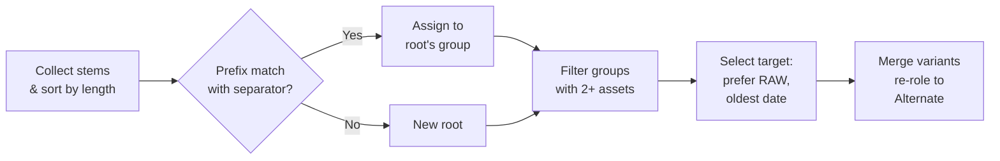

# Organizing Assets

Once your files are [imported](03-ingest.md), MAKI provides several tools for
organizing them: tags, metadata editing, variant grouping, static collections,
and saved searches. All changes are persisted in both the SQLite catalog and
YAML sidecar files. When `.xmp` recipe files are present, edits to ratings,
tags, descriptions, and color labels are written back to disk for bidirectional
sync with tools like CaptureOne and Lightroom.

---

## Tags

Tags are free-form keywords attached to an asset. They are deduplicated
automatically -- tags from XMP sidecar files, embedded XMP in JPEGs, and
manual additions are merged into a single set.

### Hierarchical tags

Tags can contain `/` as a hierarchy separator, allowing you to organize
keywords into a tree structure:

```
maki tag a1b2c3d4 animals/birds/eagles
maki tag a1b2c3d4 location/europe/germany
```

Parent tag searches match all descendants -- searching for `tag:animals` will
find assets tagged `animals/birds/eagles`. This works in both CLI and web UI
searches.

Hierarchical tags interoperate with Lightroom's `lr:hierarchicalSubject` XMP
field. When importing XMP files that contain `lr:hierarchicalSubject` entries,
MAKI reads the hierarchy and stores the full path as a tag. Write-back preserves
the hierarchy in the XMP file.

The tags page in the web UI displays hierarchical tags as a collapsible tree
(see [Web UI](06-web-ui.md) for details).

### Adding tags

Pass one or more tag names after the asset ID:

```
maki tag a1b2c3d4 landscape nature golden-hour
```

This adds three tags to the asset. If a tag already exists on the asset, it is
silently skipped.

### Removing tags

Use the `--remove` flag:

```
maki tag a1b2c3d4 --remove unwanted blurry
```

Tags that are not present on the asset are silently ignored.

### XMP write-back

When an asset has `.xmp` recipe files on disk, tag changes are written back
immediately. Added tags are inserted into the `dc:subject` / `rdf:Bag` block;
removed tags are deleted from it. Tags that were added independently in
CaptureOne or Lightroom (not managed by maki) are preserved -- maki operates on
deltas, not full replacement.

If the volume containing the `.xmp` file is offline, the write-back is skipped
with a warning.

### Renaming tags

To rename a tag across all assets that have it — for example, reorganizing a flat tag into a hierarchy, normalizing casing, or fixing a typo:

```bash
# Preview what would change
maki tag rename "Munich" "location/Germany/Bavaria/Munich"

# Apply the rename
maki tag rename "Munich" "location/Germany/Bavaria/Munich" --apply --log
```

Matching is case-insensitive: `maki tag rename "Concert" "concert"` finds "Concert", "CONCERT", and "concert" and normalizes them all.

When renaming to a hierarchical tag, standalone tags that are now ancestors of the new tag are automatically removed. For example, renaming "Munich" to "location/Germany/Bavaria/Munich" also removes standalone "Germany" and "Bavaria" tags — since `tag:Germany` now matches via the hierarchy, keeping them separately would be redundant.

### Browsing tags in the web UI

The web UI provides a dedicated tags page at `/tags` with:

- **Sortable columns** -- click the Name or Count header to sort ascending or
  descending.
- **Live text filter** -- type 2 or more characters to filter the tag list
  in real time.
- **Multi-column layout** -- adapts to the viewport width using CSS columns.

Clicking a tag name navigates to the browse page filtered to that tag.

---

## Editing Metadata

The `maki edit` command sets or clears first-class metadata fields on an asset.
At least one flag is required.

### Setting fields

```
maki edit a1b2c3d4 --name "Sunset at Beach"
maki edit a1b2c3d4 --description "A beautiful sunset over the Pacific coast"
maki edit a1b2c3d4 --rating 5
maki edit a1b2c3d4 --label Red
maki edit a1b2c3d4 --date "2024-12-25"
```

Multiple flags can be combined in a single invocation:

```
maki edit a1b2c3d4 --name "Sunset at Beach" --rating 5 --label Orange
```

### Clearing fields

Each field has a corresponding `--clear-*` flag:

```
maki edit a1b2c3d4 --clear-name
maki edit a1b2c3d4 --clear-description
maki edit a1b2c3d4 --clear-rating
maki edit a1b2c3d4 --clear-label
maki edit a1b2c3d4 --clear-date
```

An empty description string is normalized to a clear operation -- these two
commands are equivalent:

```
maki edit a1b2c3d4 --description ""
maki edit a1b2c3d4 --clear-description
```

### Color labels

The label field accepts one of seven colors: **Red**, **Orange**, **Yellow**,
**Green**, **Blue**, **Pink**, **Purple**. Input is case-insensitive and stored
in canonical title-case:

```
maki edit a1b2c3d4 --label red      # stored as "Red"
maki edit a1b2c3d4 --label YELLOW   # stored as "Yellow"
```

This is a superset of Lightroom's 5-color palette, matching CaptureOne's 7
colors.

### XMP write-back for metadata

Changes to **rating**, **description**, and **color label** are automatically
written back to any `.xmp` recipe files attached to the asset. This enables
round-trip editing with external tools:

1. Rate an image in maki (`maki edit ... --rating 4`).
2. Open CaptureOne -- the rating is already reflected in the XMP sidecar.
3. Change the rating in CaptureOne.
4. Run `maki refresh` to pick up the change.

### Structured output

Use the global `--json` flag for machine-readable output:

```
maki --json edit a1b2c3d4 --rating 5
```

---

## Manual Grouping

The `maki group` command merges multiple variants (identified by their content
hashes) into a single asset. This is useful when related files were imported
separately and ended up as distinct assets.

### Basic usage

```
maki group abc123def456 789fed321cba
```

You can pass any number of content hashes. maki identifies the assets that own
those variants and merges them.

### Merge rules

- The **oldest asset** (by `created_at`) is chosen as the target.
- Donor variants that had the **Original** role are re-roled to **Alternate**
  (in both the YAML sidecar and the SQLite catalog) to avoid multiple
  originals on one asset.
- **Tags** from donor assets are merged into the target (union, deduplicated).
- **Recipes** from donor assets are moved to the target.
- Donor assets are **deleted** after merging.

### Finding content hashes

Use `maki show` to display an asset's variants and their content hashes:

```
maki show a1b2c3d4
```

Or use `maki search --format '{id}\t{name}'` to locate the assets first, then
inspect them with `maki show`.

---

## Auto-Grouping

The `maki auto-group` command finds assets that belong together by matching
their filename stems across the catalog. This handles the common case where a
RAW original and its processed exports end up as separate assets -- for
example, when CaptureOne exports land in a different directory from the
originals.

### Report mode (dry run)

Without `--apply`, auto-group runs in report-only mode. Nothing is modified:

```
maki auto-group
```

Output shows which groups would be formed, how many donors would be merged, and
how many variants would be moved.

### Applying changes

```
maki auto-group --apply
```

### Scoping to a search query

Pass a search query to limit the scope:

```
maki auto-group "tag:landscape" --apply
maki auto-group "path:Capture/2024" --apply
```

### The matching algorithm

Auto-group uses fuzzy prefix matching with separator-boundary detection:



**Steps in detail:**

1. Collect the filename stem (without extension) of each asset and sort by length (shortest first).
2. For each stem, check if any existing shorter stem is a prefix match with a separator boundary — the character after the prefix must be non-alphanumeric (`-`, `_`, space, `(`). If so, assign to that group. Otherwise, register as a new root.
3. Filter to groups with 2+ assets. Select a target per group (prefer assets with a RAW variant, then oldest by `created_at`). Merge donor variants into the target and re-role Original to Alternate.

**Matching examples:**

| Shorter stem | Longer stem | Next char | Result |
|---|---|---|---|
| `Z91_8561` | `Z91_8561-1-HighRes` | `-` (hyphen) | Match |
| `Z91_8561` | `Z91_8561_edit` | `_` (underscore) | Match |
| `DSC_001` | `DSC_0010` | `0` (digit) | No match |
| `IMG_2000` | `IMG_2000 (1)` | ` ` (space) | Match |

**Chain resolution:** When multiple stems form a chain, they all resolve to
the shortest root. For example, `Z91_8561`, `Z91_8561-1`, and
`Z91_8561-1-HighRes` all group under `Z91_8561`.

**Target selection:** Within each group, the target asset is the one with a RAW
variant (if any), breaking ties by oldest `created_at` timestamp. Donor
variants with the Original role are re-roled to Alternate, just like manual
grouping.

### Output options

```
maki auto-group --json            # structured JSON result
maki auto-group --log --apply     # per-group progress on stderr
```

### Web UI

In the web UI, select multiple assets on the browse page, then click the
**"Group by name"** button in the batch toolbar. A confirmation dialog shows
how many groups would be formed before applying.

---

## Splitting Assets

The inverse of grouping: extract one or more variants from an asset into new standalone assets.

```
# View variants of an asset
maki show abc12345

# Extract the JPEG variant into its own asset
maki split abc12345 sha256:def456...
```

Each extracted variant becomes a new asset with:
- Role set to `original`
- Tags, rating, color label, and description copied from the source
- Associated recipes moved with the variant

In the web UI, the asset detail page shows checkboxes next to each variant. Select the variants to extract and click "Extract as new asset(s)".

**Constraints:** At least one variant must remain in the source asset.

### Cleaning up after a mis-group

When assets are accidentally grouped, their tags get merged. After splitting them apart, the new assets inherit the merged tags. To clean up:

```
# Split the mis-grouped variant out
maki split abc12345 --variant def456...

# Clear the inherited merged tags from the new asset
maki edit <new-asset-id> --clear-tags

# Re-read the original tags from the XMP sidecar
maki refresh --asset <new-asset-id>
```

---

## Collections (Static Albums)

Collections are manually curated lists of assets -- the equivalent of albums
in a traditional photo manager. They are backed by both SQLite (for fast
queries) and a `collections.yaml` file at the catalog root (which survives
`rebuild-catalog`).

The alias `maki col` can be used in place of `maki collection` for brevity.

### Creating a collection

```
maki collection create "Best of 2024" --description "Top picks from the year"
```

### Listing collections

```
maki collection list
```

### Viewing collection contents

```
maki collection show "Best of 2024"
maki collection show "Best of 2024" --format full
```

### Adding assets

```
maki collection add "Best of 2024" a1b2c3d4 e5f6a7b8
```

You can pipe asset IDs from a search:

```
maki search -q "rating:5 tag:landscape" | xargs maki col add "Best of 2024"
```

This is a powerful pattern -- combine any search filter to build a collection
in a single command.

### Removing assets

```
maki collection remove "Best of 2024" a1b2c3d4
```

### Deleting a collection

```
maki collection delete "Best of 2024"
```

This removes the collection definition and all membership records. The assets
themselves are not affected.

### Searching within a collection

Use the `collection:` filter in any search:

```
maki search "collection:\"Best of 2024\" rating:4+"
```

Note the quoted value for collection names with spaces.

### Web UI

- The **`/collections`** page lists all collections with a **"+ New Collection"**
  button.
- On the **asset detail page**, collection membership is shown as chips with
  a remove button.
- In the **batch toolbar**, a collection dropdown lets you add or remove
  selected assets from a collection. The dropdown includes a **"New..."**
  option that creates a collection inline.

---

## Stacks

Stacks are lightweight anonymous groups of assets -- burst shots, exposure
brackets, or similar scenes that you want to collapse into a single entry in the
browse grid. Unlike grouping (which permanently merges variants into one asset),
stacks keep each asset independent. You can dissolve a stack at any time to
separate the assets again.

Each asset can belong to at most one stack. Members are position-ordered;
position 0 is the **pick** -- the representative image shown when the stack is
collapsed in the browse grid. Stacks auto-dissolve when they have one or fewer
members.

The alias `maki st` can be used in place of `maki stack` for brevity.

### Creating a stack

Pass two or more asset IDs to create a new stack:

```
maki stack create a1b2c3d4 e5f6a7b8 c9d0e1f2
```

The first asset becomes the pick (position 0). The remaining assets are ordered
by their position in the argument list.

### Adding assets to a stack

```
maki stack add <stack-id> f3a4b5c6
```

The new asset is appended to the end of the stack.

### Setting the pick

Promote any member to the pick position:

```
maki stack pick <stack-id> e5f6a7b8
```

The previous pick moves to position 1; all other positions shift accordingly.

### Removing assets from a stack

```
maki stack remove <stack-id> c9d0e1f2
```

If the stack has one or fewer members after removal, it auto-dissolves.

### Dissolving a stack

Dissolve a stack entirely, returning all members to standalone assets:

```
maki stack dissolve <stack-id>
```

### Listing stacks

```
maki stack list
```

Shows all stacks with their member counts.

### Showing stack details

```
maki stack show <stack-id>
```

Displays the stack's members in position order, with the pick marked.

### Searching for stacked assets

Use the `stacked:` filter in any search:

```
maki search "stacked:true"      # assets that are in a stack
maki search "stacked:false"     # standalone assets
```

### Converting tags to stacks

Some tools (notably CaptureOne) represent auto-stacking as tags rather than a native stacking structure. The `from-tag` subcommand converts these tags into proper MAKI stacks:

```bash
# Preview: find assets with CaptureOne auto-stack tags
maki stack from-tag "Aperture Stack {}"

# Apply and remove the tags afterwards
maki stack from-tag "Aperture Stack {}" --remove-tags --apply
```

The `{}` wildcard matches a group identifier — assets sharing the same matched value are grouped into a stack. For example, if you have assets tagged `Aperture Stack 1` and `Aperture Stack 2`, this creates two stacks.

This works with any tag pattern, not just CaptureOne:

```bash
# Convert Lightroom-style stack tags
maki stack from-tag "Stack {}"

# Convert bracketing tags
maki stack from-tag "Bracket {}"
```

### Structured output

All stack commands support `--json`:

```
maki --json stack list
maki --json stack show <stack-id>
```

### Web UI

See [Web UI](06-web-ui.md) for the stack experience in the browse grid, batch
operations, and asset detail page.

---

## Saved Searches (Smart Albums)

Saved searches are named queries stored in `searches.toml` at the catalog root.
Unlike collections, they are dynamic -- running a saved search always reflects
the current state of the catalog.

The alias `maki ss` can be used in place of `maki saved-search`.

### Saving a search

```
maki saved-search save "Landscapes" "tag:landscape rating:3+" --sort date_desc
```

This stores the query string and sort order under the name "Landscapes".

### Listing saved searches

```
maki saved-search list
```

### Running a saved search

```
maki saved-search run "Landscapes"
maki saved-search run "Landscapes" --format full
maki saved-search run "Landscapes" --format json
```

### Deleting a saved search

```
maki saved-search delete "Landscapes"
```

### Favorites

Mark a saved search as a **favorite** to pin it as a quick-access chip on the web UI browse toolbar:

```
maki ss save "Five Stars" "rating:5" --favorite
maki ss save "Unrated"    "rating:0 type:image" --favorite
maki ss save "At Risk"    "copies:1" --favorite
```

Favorite searches appear as clickable chips above the browse grid — one click to filter, another to clear. This is the fastest way to access your most-used views.

### Practical examples

Save commonly used filters for quick access:

```
maki ss save "Unrated"     "rating:0"
maki ss save "Five Stars"  "rating:5"
maki ss save "Red Label"   "label:Red"
maki ss save "Recent"      "path:Capture/2024" --sort date_desc
maki ss save "Orphans"     "orphan:true"
maki ss save "Theater"     "tag:\"Fools Theater\""
```

Combine saved searches with other commands:

```
maki ss run "Five Stars" --format ids | xargs maki col add "Portfolio"
```

### Web UI

- **Clickable chips** on the browse page load saved searches into the filter
  UI with a single click.
- The **Save button** captures the current search state (query, filters, sort
  order) as a new saved search.
- **Hover** over a chip to reveal rename and delete buttons.

---

## People Management (Face Recognition) *(Pro)*

MAKI can detect faces in your images, group them into people, and let you search by person. Uses YuNet for face detection and ArcFace for face recognition.

### Setup

Download the required models first:

```
maki faces download
```

This downloads the YuNet face detection model (~230 KB) and ArcFace recognition model (~28 MB) to the model cache directory.

### Detecting faces

Run face detection on your catalog:

```
maki faces detect --query "type:image" --apply
```

This finds faces in each image's preview, stores bounding boxes and embeddings, and generates face crop thumbnails. Use `--log` for per-asset progress.

You can scope detection to a specific shoot or volume:

```
maki faces detect --query "path:Capture/2026-03" --apply
maki faces detect --volume "Photos" --apply
maki faces detect --asset a1b2c3d4 --apply
```

### Clustering faces into people

After detection, cluster similar faces into groups:

```
maki faces cluster --apply
```

This uses greedy single-linkage clustering to group faces that look similar enough (default threshold 0.5). Each group becomes an unnamed person.

Adjust the threshold for stricter or looser grouping:

```
maki faces cluster --threshold 0.6 --apply    # stricter (fewer false matches)
maki faces cluster --threshold 0.4 --apply    # looser (more grouped together)
```

### Naming people

List the discovered people and name them:

```
maki faces people
maki faces name 550e8400-... "Alice"
maki faces name 661f9511-... "Bob"
```

### Managing people

Merge duplicate person groups:

```
maki faces merge 550e8400-... 661f9511-...    # merge source into target
```

Remove a face from a person (misidentification):

```
maki faces unassign face-uuid-...
```

Delete a person entirely (faces become unassigned):

```
maki faces delete-person 550e8400-...
```

### Searching by face and person

Use the `faces:` and `person:` search filters:

```
maki search "faces:any"                # assets with detected faces
maki search "faces:none type:image"    # images without faces
maki search "faces:2+"                # group photos (2+ faces)
maki search "person:Alice"            # assets containing Alice
maki search "person:Alice rating:4+"  # Alice's best photos
```

### Web UI

The web UI provides a complete face management experience:

- **People page** (`/people`) — gallery grid of person cards with thumbnails, names, and face counts. Inline rename, merge, and delete. "Cluster" button for on-demand clustering.
- **Asset detail page** — faces section shows detected faces as chips with crop thumbnails and confidence scores. "Detect faces" button for on-demand detection. Assign/unassign faces to people via dropdown.
- **Browse filters** — person dropdown in the filter row, and `faces:` filter in the query input.
- **Batch toolbar** — "Detect faces" button processes all selected assets.
- **Browse cards** — face count badge alongside variant count.

### Configuration

In `maki.toml`:

```toml
[ai]
face_cluster_threshold = 0.5    # clustering similarity threshold
face_min_confidence = 0.5       # minimum detection confidence
```

---

## Deleting Assets

Tagging images as `rest` or leaving them unrated hides them from browsing (see [Organizing & Culling](10-organizing-and-culling.md)), but the files and catalog records remain. When you want to permanently remove assets — confirmed rejects, test shots, accidental imports — use `maki delete`.

### When to delete vs. cull

For most images, culling (tagging as `rest` or leaving unrated) is the better choice. Deletion is permanent and cannot be undone. Consider deleting only when:

- The files genuinely have no value (accidental shutter fires, blank frames, duplicates you've already deduplicated)
- You need to reclaim disk space and are certain you have backups
- You imported files by mistake (wrong folder, wrong file types)

### Report-only default

Without `--apply`, the command shows what would happen without changing anything:

```bash
maki delete a1b2c3d4
```

```
Would delete: DSC_0042 (2 variants, 3 locations, 1 recipe)
  Dry run — no changes made. Run with --apply to delete.
```

### Catalog-only deletion

With `--apply` but without `--remove-files`, MAKI removes the asset from the catalog and sidecar files but leaves the physical files untouched on disk:

```bash
maki delete a1b2c3d4 --apply
```

This is useful when you want to stop tracking a file in MAKI but don't want to touch the originals. You can re-import the files later if needed.

### Physical file deletion

With `--remove-files`, the physical files are also deleted from all online volumes:

```bash
maki delete a1b2c3d4 --apply --remove-files
```

Files on offline volumes are not deleted — they remain on disk until you reconnect the volume and run `maki cleanup`.

### Batch deletion

Combine search with delete for bulk cleanup:

```bash
# Preview: which assets would be deleted?
maki search "tag:reject" --format short

# Delete all rejected assets (catalog only)
maki search -q "tag:reject" | maki delete --apply --log

# Delete rejected assets AND their physical files
maki search -q "tag:reject" | maki delete --apply --remove-files --log
```

For the full command reference, see [delete](../reference/02-ingest-commands.md#maki-delete).

---

## Putting It All Together

A typical organizing workflow after import might look like this:

1. **Auto-group** to merge related variants:
   ```
   maki auto-group --apply --log
   ```

2. **Tag** a batch of assets from the CLI:
   ```
   maki search -q "path:Capture/2024-08-15" | \
     xargs -I{} maki tag {} vacation beach
   ```

3. **Rate and label** standouts in the web UI using keyboard shortcuts
   (1-5 for ratings, r/o/y/g/b/p/u for labels).

4. **Build a collection** from your top picks:
   ```
   maki search -q "rating:5 tag:vacation" | xargs maki col add "Summer 2024"
   ```

5. **Save a smart search** for ongoing curation:
   ```
   maki ss save "Vacation Selects" "tag:vacation rating:4+" --sort date_desc
   ```

---

Next: [Browsing & Searching](05-browse-and-search.md) |
Previous: [Ingesting Assets](03-ingest.md) |
[Back to Manual](../index.md)
