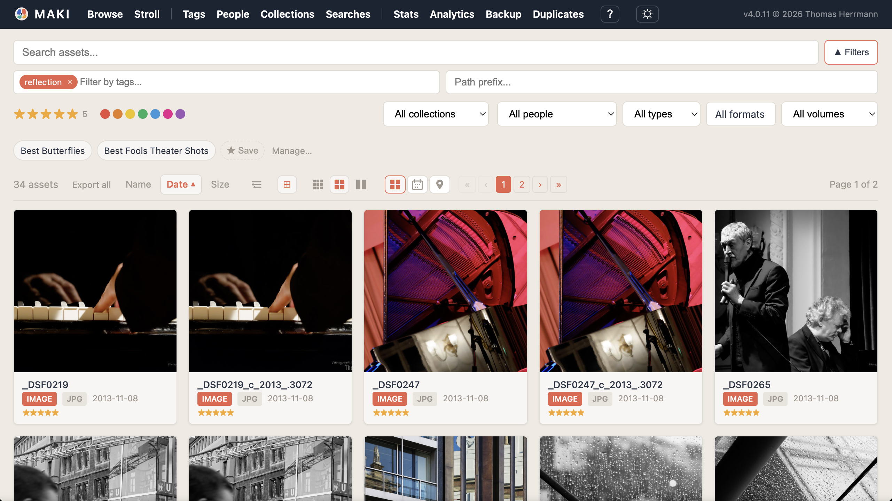
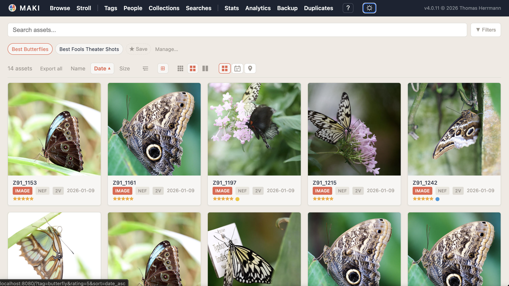
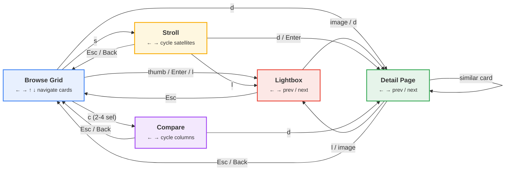
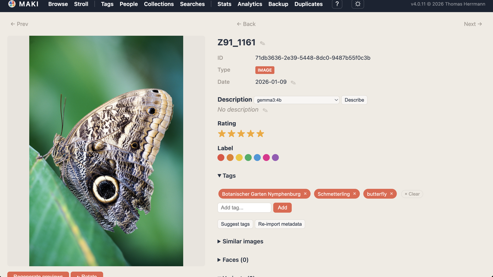
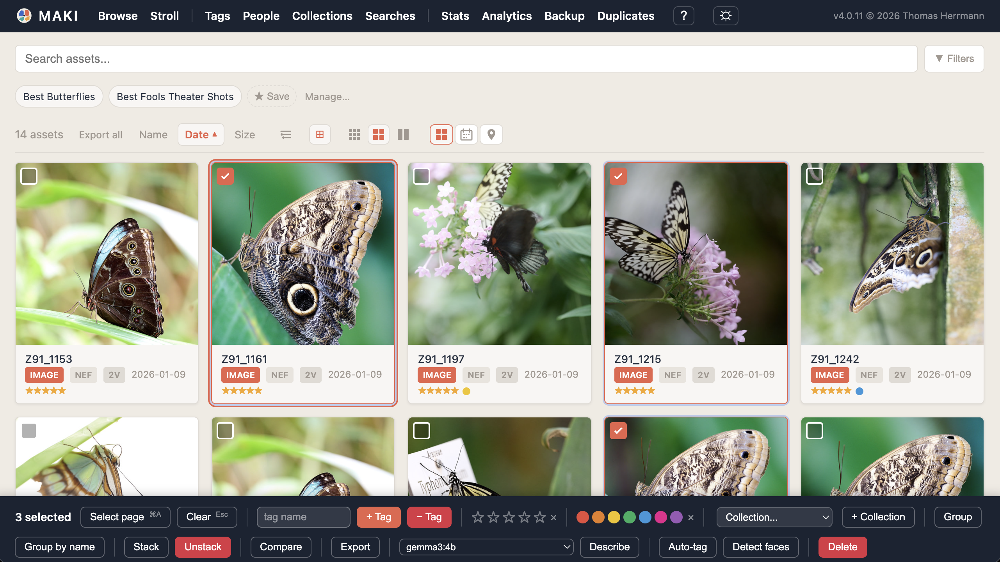
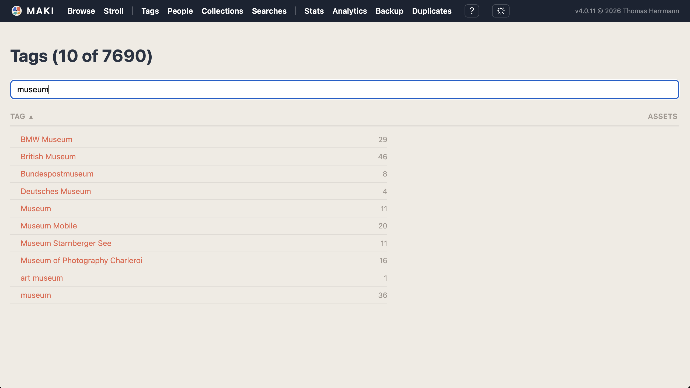
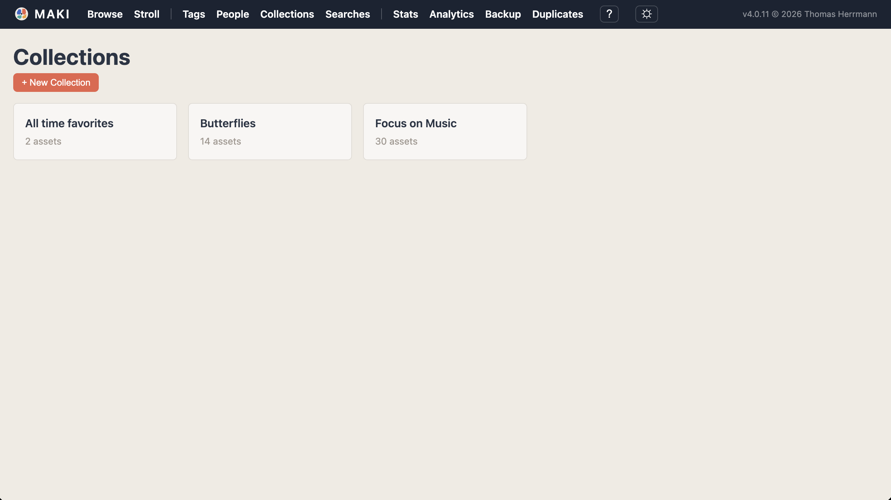

# Web UI

dam includes a browser-based interface for browsing, searching, and editing your catalog. It runs as a local web server and provides a responsive grid view of your assets, inline metadata editing, batch operations, and keyboard-driven navigation. All changes made in the web UI are written to both the SQLite catalog and YAML sidecar files, and any editable fields (rating, tags, description, color label) are automatically synced back to XMP recipe files on disk.


## Starting the Web UI

Launch the server with `dam serve`:

```bash
dam serve
```

Output:

```
Listening on http://127.0.0.1:8080
```

Open that URL in your browser to start browsing. The server runs in the foreground; press Ctrl+C to stop it.

### Custom port and bind address

Use `--port` and `--bind` to change the listening address:

```bash
dam serve --port 9090 --bind 0.0.0.0
```

Binding to `0.0.0.0` makes the UI accessible from other devices on your local network (use with caution on untrusted networks).

### Request logging

Add the `--log` flag to print each HTTP request to stderr:

```bash
dam serve --log
```

Output on stderr:

```
GET / -> 200 (12ms)
GET /static/style.css -> 200 (1ms)
GET /previews/ab/ab3f...jpg -> 200 (2ms)
```

This is useful for debugging slow requests or understanding access patterns.

### Configuration via dam.toml

You can set default values for port and bind address in the `[serve]` section of `dam.toml`:

```toml
[serve]
port = 9090
bind = "127.0.0.1"
```

Command-line flags always override `dam.toml` settings. See the [Configuration Reference](../reference/08-configuration.md) for details.


## Dark Mode

The web UI supports dark mode. A toggle button (sun/moon icon) in the navigation bar switches between light and dark themes. Your preference is saved in the browser and applied instantly on every page load.

If you haven't chosen a theme explicitly, the UI follows your operating system preference automatically (via `prefers-color-scheme`). Dark mode covers all pages: browse, asset detail, tags, collections, stats, and backup status.


## Browse Page

The browse page is the main entry point for the web UI. It shows a searchable, filterable grid of asset thumbnails.



### Search bar

The search bar has two rows:

**Row 1** -- a full-width text input for free-text search. Type any keyword, filename, or structured filter (like `camera:"Canon EOS R5"`) and results update as you type with a 300ms debounce. Press Enter to search immediately without waiting for the debounce.

The filter bar is collapsible. Press **Shift+F** to toggle its visibility on the browse page. Your preference is saved in the browser. This is useful for maximizing screen space when you want to focus on the grid without changing filters.

**Row 2** -- a row of filter controls, left to right:

- **Tag filter**: a chip-based input with autocomplete. Type to see tag suggestions, click or press Enter to add a tag chip. Multiple tags narrow the results (AND logic). Remove a tag by clicking the x on its chip, or press Backspace in an empty input to remove the last chip. Adding or removing a tag triggers an immediate search.
- **Star rating filter**: five clickable stars with a three-state cycle. First click sets an exact match (e.g. "3"), second click switches to minimum match ("3+"), third click clears the filter. Star 5 is two-state (exact and clear, since 5 and 5+ are identical). Triggers an immediate search.
- **Color label filter**: seven colored dots (Red, Orange, Yellow, Green, Blue, Pink, Purple). Click a dot to filter by that label. Click the active dot again to clear. Triggers an immediate search.
- **Type dropdown**: filter by asset type (Image, Video, Audio, Document). Triggers immediately on change.
- **Format filter**: a grouped multi-select dropdown. Click the trigger button to open a panel showing all formats in your catalog organized by category (RAW, Image, Video, Audio, Other). Each format shows its variant count. Check individual formats or use the group-level toggles ("All RAW", "All Image", etc.) to select entire categories. Multiple selections combine with OR logic (e.g., selecting NEF and CR3 shows assets in either format). The trigger button shows: "All formats" when nothing is selected, the format name for a single selection, the group name when a full group is selected (e.g., "All RAW"), or a compact summary like "nef +3..." for mixed selections. Hover the button to see the full list in a tooltip. Triggers an immediate search on every checkbox change.
- **Volume dropdown**: filter by storage volume. Only shown when you have registered volumes. Triggers immediately on change.
- **Collection dropdown**: filter by collection membership. Only shown when you have collections. Triggers immediately on change.
- **Path prefix input**: filter by file location path prefix. Type a directory path to see only assets stored under that path. Debounces at 300ms, Enter fires immediately.

All filters compose with each other. You can combine a text search with a tag, a minimum rating, a color label, and a volume restriction at the same time.

### Results grid

Below the search bar, results appear as a grid of thumbnail cards. Each card shows:

- A preview thumbnail (lazy-loaded for performance)
- The asset name (or filename as fallback)
- Badges for type and primary format (e.g., "image" and "NEF")
- A variant count badge when the asset has multiple variants (e.g., "3v")
- A stack badge when the asset is in a stack (e.g., a small grid icon with the member count)
- Star rating (filled stars)
- Color label dot

Cards that belong to a stack have a colored left border for quick visual identification.

**Stack collapsing**: By default, stacks are collapsed -- only the pick image (position 0) is shown in the grid, with a stack count badge indicating how many assets are hidden. A collapse toggle in the results bar lets you expand all stacks so every member is visible. When expanded, all stack members appear in position order with the colored border indicating membership.

**Per-stack expand/collapse**: Click the stack badge (⊞ N) on any browse card to expand or collapse just that individual stack, regardless of the global collapse setting. When stacks are globally collapsed, clicking a badge fetches and displays that stack's members inline. When stacks are globally expanded, clicking a badge collapses only that stack while others remain expanded. Re-clicking restores the previous state.

Click a card to open the [asset detail page](#asset-detail-page).

### View mode toggle

Next to the density controls, three view mode buttons switch between **Grid**, **Calendar**, and **Map** views:

- **Grid** (default): the standard thumbnail grid described above
- **Calendar**: a year-at-a-glance heatmap showing when assets were created
- **Map**: a map showing geotagged assets as clustered markers

Your view mode preference is saved in the browser and preserved across reloads.

### Calendar heatmap view

The calendar view displays a GitHub-style heatmap with 12 months laid out in a responsive grid (4 columns on wide screens, adapting down to 2 on narrow ones). Each day cell is colored by the number of assets created on that date, using a quartile-based 5-level color scale from empty (no assets) through increasingly intense shades.

**Year navigation**: Arrow buttons and clickable year chips above the calendar let you browse between years. Only years that contain assets appear as chips.

**Filter integration**: All browse filters (text search, tag, rating, label, type, format, volume, collection, path) apply to the calendar aggregation. For example, adding `tag:landscape` shows only landscape photos in the heatmap, letting you see which dates had landscape shots.

**Day click**: Click any day cell to filter the browse grid to that date. The view switches back to grid mode with `date:YYYY-MM-DD` added to the search query, showing only assets from that day. You can then clear the date filter from the search input to return to unfiltered browsing.

**Legend**: A color scale legend at the bottom of the calendar shows the meaning of each intensity level.

### Map view

The map view displays geotagged assets on an interactive OpenStreetMap map powered by Leaflet.js. Assets with GPS coordinates appear as markers, automatically clustered at wider zoom levels for performance.

**Markers and popups**: Click a marker (or cluster) to see a popup with a thumbnail preview, asset name, rating stars, and color label dot. Click the thumbnail to open the asset in the lightbox with full prev/next navigation through visible markers. Click the name or metadata area to navigate to the asset detail page.

**Filter integration**: All browse filters (text search, tag, rating, label, type, format, volume, collection, path, date) apply to the map. Adding `tag:landscape` shows only landscape photos on the map. The `geo:` search filter also works: `geo:any` shows only geotagged assets, `geo:none` shows assets without GPS data, and `geo:52.5,13.4,10` restricts to a 10km radius around a point.

**Dark mode**: Map tiles are automatically inverted for the dark theme to maintain visual consistency. Popups and controls adapt to the current color scheme.

**Keyboard shortcut**: Press `m` to switch to map view from any other view mode.

**Embedded libraries**: Leaflet.js and MarkerCluster are embedded as static assets — no external CDN or internet connection is required. The map tiles themselves are loaded from OpenStreetMap servers, so an internet connection is needed for the tile layer (but not for the application code).

### Grid density

Next to the sort controls, three grid density buttons let you adjust the thumbnail size:

- **Compact** (3×3 grid icon): smaller thumbnails, metadata and star ratings hidden, tighter spacing. Good for scanning many images quickly.
- **Normal** (2×2 grid icon): the default layout with full metadata.
- **Large** (1×2 grid icon): bigger thumbnails with room for two-line titles. Good for detailed visual comparison.

Your density preference is saved in the browser and preserved across page reloads and navigation.

### Faceted sidebar

The faceted sidebar provides a read-only statistical breakdown of your current results by rating, color label, format, volume, tag, year, and geolocation. It helps you understand the distribution of values in your collection at a glance. All filtering is done through the filter bar at the top of the page.

**Toggle**: Click the facet icon button in the results bar (next to the stack collapse button) or press `f`. The sidebar appears on the left side of the browse page. Your preference is saved in the browser.

**Facet sections**: Each section is collapsible. Ratings and years include a proportional bar chart. Labels show color dots. Formats, volumes, and tags show counts sorted by frequency. The geotagged facet shows a single count of assets with GPS data. Counts automatically update when the current search filters change.

**Collapse state**: Each section remembers its open/closed state in the browser across page loads.

**Responsive**: The sidebar is hidden on viewports narrower than 768px.

### Sorting

Above the results grid, sort toggle buttons let you order results by **Name**, **Date**, or **Size**. Each button toggles between ascending and descending. The active sort shows a direction arrow. Clicking a sort button updates results immediately.

### Pagination

When results span multiple pages, pagination controls appear both above and below the grid:

- First page, previous page, numbered page links, next page, last page
- A "Page X of Y" indicator

Page numbers with ellipsis keep the controls compact for large result sets. The number of results per page defaults to 60 and can be configured via `[serve] per_page` in `dam.toml` or the `--per-page` CLI flag.

Use **Shift+Left/Right arrow** keys to quickly turn pages from the keyboard. The results grid fades during loading to provide visual feedback while the new page loads. In the lightbox, regular arrow keys at page boundaries automatically navigate to the next/previous page with a loading spinner overlay.

### Saved search chips



Below the search bar, a row of saved search chips provides quick access to your named searches (smart albums). Each chip loads its stored query and filters into the search bar when clicked.

- **Save the current search**: click the "Save" button at the end of the chip row. A prompt asks for a name, and the current search state (text query, filters, sort order) is saved.
- **Rename**: hover over a chip to reveal the rename button. Click it and enter a new name.
- **Delete**: hover over a chip to reveal the delete button. Click it and confirm.

Saved searches are stored in `searches.toml` at the catalog root and work identically to CLI saved searches (see [Organizing Assets](04-organize.md) for the `dam saved-search` command).

### How page updates work

The web UI uses [htmx](https://htmx.org/) for partial page updates. When you search, filter, sort, or paginate, only the results area reloads -- the search bar and its state remain intact. This makes interactions fast and fluid.

Because the URL updates with every search (via `hx-push-url`), the browser back button, forward button, reload, and bookmarks all work correctly. Navigating back from an asset detail page also refreshes results to reflect any edits you made.


## Navigation Between Views

The browse grid, lightbox, detail page, stroll, and compare form a connected navigation graph. You can switch between views with keyboard shortcuts, clicks, and the browser back button. Focus, scroll position, and selection are preserved when you return to browse.



| From | Action | To |
|------|--------|----|
| Browse | Thumbnail click / Enter / `l` | Lightbox |
| Browse | `d` | Detail page |
| Browse | `s` | Stroll (from focused card) |
| Browse | `c` (2–4 selected) | Compare |
| Lightbox | Click image / `d` | Detail page |
| Lightbox | `s` | Stroll (from current asset) |
| Lightbox | Escape | Close overlay (return to host page) |
| Lightbox | Left / Right arrows | Prev / next asset |
| Detail | Click image / `l` | Lightbox |
| Detail | Left / Right arrows | Prev / next detail page |
| Detail | Similar card click | Detail (chained navigation) |
| Detail | `s` | Stroll (from current asset) |
| Detail | Escape / Back | Previous page (`history.back()`) |
| Stroll | `l` | Lightbox (center or focused satellite) |
| Stroll | `d` / Enter | Detail page |
| Stroll | Escape / Back | Previous page (`history.back()`) |
| Compare | `d` | Detail page (focused column) |
| Compare | Escape / Back | Previous page (`history.back()`) |
| Any page | Shift+B | Jump directly to browse grid |

### Back navigation

There are two distinct "go back" actions:

- **Escape** (or browser Back button) — step back one level. On a page, this returns to wherever you came from via `history.back()`. In the lightbox overlay, it closes the overlay. On the browse grid, it clears the current selection or focus.
- **Shift+B** — jump directly to the browse grid, regardless of how deep you are. Useful when you've followed a chain of similar images or navigated through stroll and want to return to your search results.

The lightbox is available on browse, detail, and stroll pages. It uses the same shared component with page-specific callbacks for rating/label changes and navigation. Rating and color label editing (stars, color dots, 0–5 / Alt+1–7 keys) works everywhere the lightbox is open.

Focus and scroll position are preserved when navigating back to the browse page, even when the browser restores the page from its back/forward cache. Arrow key navigation in the lightbox and detail page updates which card will be focused when you return to browse.


## Lightbox

Clicking a thumbnail opens a full-screen lightbox overlay. The lightbox is available on the browse grid, detail page, and stroll page.

### Navigation

- **Arrow buttons**: click the left (‹) or right (›) side panels to move to the previous or next asset
- **Keyboard**: Left and Right arrow keys navigate between assets
- **Counter**: the top bar shows your position (e.g., "3 / 156")
- **Close**: click the × button or press Escape to close the overlay
- **Detail page**: click the image, press `d`, or click "↗ Detail" to open the full detail page for the current asset
- **Stroll**: press `s` to start strolling from the current asset

### Info panel

Click the ℹ button in the top bar (or press `i`) to toggle a side panel showing:

- **Metadata**: asset type, format, date, and variant count
- **Rating**: interactive stars — click to set a rating (1-5), click × to clear
- **Color label**: interactive color dots — click to set a label, click × to clear

Rating and label changes made in the lightbox are saved immediately via the API and reflected on the host page. The top bar also shows interactive rating stars and color label dots for quick editing without opening the info panel.

The info panel has its own × close button.

### Rating and label

The lightbox top bar shows interactive rating stars and color label dots, always visible without opening the info panel. Click a star to set rating, click × to clear. Click a color dot to set a label, click the active dot again to clear.

These controls are also available in the info panel with more detail, but the top bar provides quick access during rapid browsing.

### Smart preview and zoom

When a smart preview (high-resolution, 2560px) is available, the lightbox loads the regular preview instantly for display, then background-loads the smart preview. A pulsing **HD** badge in the top-right corner provides visual feedback during loading. Once the smart preview loads, the badge briefly shows with solid opacity before fading out.

With a smart preview loaded, you can zoom and pan:

- **Mouse wheel**: zoom in/out centered on cursor position
- **Drag**: pan the image when zoomed in (cursor changes to grab/grabbing)
- **Keyboard**: `,` fit to screen, `.` 100% zoom, `+` zoom in, `-` zoom out

Smart previews can be generated via `dam import --smart`, `[import] smart_previews = true` in config, the "Generate smart preview" button on the detail page, or on-demand via `[preview] generate_on_demand = true`.

### Keyboard shortcuts

All browse keyboard shortcuts for rating and label work inside the lightbox:

| Key | Action |
|-----|--------|
| Left / Right arrow | Previous / next asset |
| Escape | Close lightbox |
| Click image | Open detail page |
| i | Toggle info panel |
| d | Open detail page |
| 1-5 | Set rating |
| 0 | Clear rating |
| Alt+1 through Alt+7 | Set color label |
| Alt+0, x | Clear color label |
| r/o/y/g/b/p/u | Set label by color initial |
| , (comma) | Fit to screen (zoom) |
| . (period) | 100% zoom |
| + | Zoom in |
| - | Zoom out |

When the lightbox is open, browse keyboard navigation (arrow keys for card focus, Enter, Space) is suppressed.


## Asset Detail Page

Click the "↗ Detail" link in the lightbox top bar, or press `d` in the lightbox, to open the asset detail page.



### Navigation

A navigation bar at the top of the page provides Prev, Back, and Next buttons:

- **Prev / Next**: navigate to adjacent assets in the browse results. These buttons use the browse page's card list (stored in sessionStorage) for unlimited multi-hop navigation — you can press Next repeatedly to step through the entire result set. When accessed via a direct URL without browse context, these buttons are hidden.
- **Back**: returns to the browse page, preserving your search and filters.

Keyboard navigation:

| Key | Action |
|-----|--------|
| Left arrow | Previous asset |
| Right arrow | Next asset |
| Click image | Open in lightbox |
| l | Open in lightbox |
| Escape | Return to browse page |

Rating, label, and zoom keyboard shortcuts also work on the detail page:

| Key | Action |
|-----|--------|
| 1-5 | Set rating |
| 0 | Clear rating |
| Alt+1 through Alt+7 | Set color label |
| Alt+0, x | Clear color label |
| r/o/y/g/b/p/u | Set label by color initial |
| , (comma) | Fit to screen (zoom) |
| . (period) | 100% zoom |
| + | Zoom in |
| - | Zoom out |

### Preview

The left side shows a large preview image. This is the best available preview for the asset, preferring export variants over processed variants over originals, and standard image formats over RAW.

When a smart preview is available, it loads in the background with a pulsing "HD" badge. Once loaded, the image supports zoom and pan via mouse wheel, drag, and keyboard shortcuts (`,` `.` `+` `-`). Clicking the preview image opens the asset in the lightbox for full-screen viewing. Buttons below the preview let you regenerate the regular preview, generate/regenerate the smart preview, or rotate the image 90° clockwise. Rotation cycles through 0° → 90° → 180° → 270° → 0° and is persisted per asset. Previews are automatically oriented using EXIF tags during generation; manual rotation is applied on top.

### Editable metadata

The right side contains the asset's metadata, all editable inline:

**Name** -- displayed as a heading. Click the pencil icon to switch to an inline text input with Save and Cancel buttons. Saving an empty name clears it, and the display falls back to the original filename in muted italic. The name is stored on the asset.

**Description** -- click the pencil icon to switch to a textarea with Save and Cancel buttons. Saving an empty description clears it. Changes are written back to XMP recipe files on disk. When a VLM server is available, a "Describe" button appears next to the heading. Click it to generate a description using the configured vision-language model — the button shows "Generating..." while waiting for the VLM response, then updates the description in-place.

**Rating** -- five clickable stars. Click a star to set that rating. Click the same star again to clear the rating. Changes are written back to XMP recipe files on disk.

**Color label** -- seven colored dots (Red, Orange, Yellow, Green, Blue, Pink, Purple) with a label name shown below the active dot. Click a dot to set that label; click the active dot again to clear it. Changes are written back to XMP recipe files on disk.

**Tags** -- displayed as removable chips. Click the x on a chip to remove that tag. Use the text input below to add new tags -- it offers autocomplete suggestions from your catalog's tag list as you type. Changes are written back to XMP recipe files on disk with operation-level deltas (tags added independently in CaptureOne or Lightroom are preserved).

**Suggest tags** (requires `--features ai`) -- a "Suggest tags" button appears below the tag input when the server is compiled with AI support. Click it to analyze the asset image with the SigLIP vision model. The button shows "Analyzing..." while the model processes (the first request may take a few seconds while the model loads). Results appear as suggestion chips, each showing the tag name and a confidence percentage. Tags already on the asset appear dimmed with an "already applied" label. Click ✓ to accept a new tag (it is added immediately), click × to dismiss it, or click "Accept new" to apply all unapplied suggestions at once.

**Re-import metadata** -- a "Re-import metadata" button appears below the tag section. Click it to clear the asset's tags, description, rating, and color label, then re-extract metadata from variant source files (XMP recipe sidecars and embedded XMP in JPEG/TIFF files). A confirmation dialog asks before proceeding since the operation is destructive. This is useful for cleaning up metadata after splitting mis-grouped assets, where tags from multiple unrelated images may have been merged together. The page reloads after completion to reflect all changes. Offline volumes are silently skipped during re-extraction.

### Asset information

Below the editable fields:

- **ID**: the asset's UUID
- **Type**: image, video, audio, or document
- **Date**: the asset's creation date (from EXIF or import time). Click the pencil icon to edit it inline with a date input and Save/Cancel buttons.

### Collections

If the asset belongs to any collections, they appear as clickable chips. Click a chip to browse that collection. Click the x button on a chip to remove the asset from that collection.

### Stack members

If the asset belongs to a stack, a section shows all members in position order with thumbnail previews. The pick is indicated. You can click any member to navigate to its detail page.

### Variants

An expandable section lists all variants of the asset in a table with columns for role, filename, format, size, and file locations (volume and path). This gives you a complete picture of where the asset's files live across your storage volumes.

For locations on online volumes, two action buttons appear next to each path:
- **📂 Reveal** — opens the system file manager with the file selected (Finder on macOS, Explorer on Windows, file manager on Linux).
- **>_ Terminal** — opens a terminal window in the file's parent directory (Terminal.app on macOS, cmd on Windows, system terminal emulator on Linux).

### Recipes

An expandable section lists attached recipe files (XMP sidecars, CaptureOne settings, etc.) with columns for recipe type, software, and file path.

### Source metadata

If the primary variant has EXIF or XMP metadata, an expandable section displays it as key-value pairs (camera model, lens, exposure settings, GPS coordinates, etc.).


## Batch Operations

The web UI supports applying changes to multiple assets at once. Select assets in the browse grid and use the batch toolbar to tag, rate, label, group, or organize them into collections.



### Selecting assets

Each browse card has a checkbox that appears on hover. Once any card is selected, all checkboxes become permanently visible (until the selection is cleared) so you can see what is selected at a glance. Selected cards receive a visible selection border.

- **Click a checkbox** to toggle selection of individual cards
- **"Select page"** button selects all cards on the current page
- **"Clear"** button deselects everything

### Batch toolbar

A fixed toolbar appears at the bottom of the screen whenever one or more assets are selected. It shows the selection count and provides these controls:

**Tags**: a text input with autocomplete, plus "+ Tag" and "- Tag" buttons. Type a partial tag name to see suggestions from your catalog's tag list; navigate with arrow keys, Enter or click to select a suggestion. Click "+ Tag" to add the tag to all selected assets, or "- Tag" to remove it. Press Enter in the input to add. Newly created tags are immediately available in the autocomplete.

**Rating**: five clickable stars and a clear button (x). Click a star to set that rating on all selected assets. Click x to clear rating.

**Color label**: seven colored dots and a clear button (x). Click a dot to set that label on all selected assets. Click x to clear label.

**Collection**: a dropdown listing your collections (plus a "New..." option to create one inline). The buttons next to it are context-sensitive:
- When you are **not** browsing a collection, a "+ Collection" button adds the selected assets to the chosen collection.
- When you **are** browsing a collection (the collection filter is active), a "- Collection" button removes the selected assets from that collection. The dropdown auto-selects the current collection.

**Stack**: creates a stack from the selected assets (or adds them to an existing stack if one of the selected assets is already stacked). The first selected asset becomes the pick. This is a lightweight, reversible grouping -- assets remain independent.

**Unstack**: removes the selected assets from their stacks. If a stack has one or fewer members after removal, it auto-dissolves.

**Group by name**: merges the selected assets by filename stem. A confirmation dialog explains the action. Assets whose filenames share a common prefix (e.g., `DSC_001.nef` and `DSC_001.jpg`) are merged into a single asset with multiple variants. This cannot be undone.

**Compare**: opens a side-by-side compare view with the selected assets (2–4). See [Compare View](#compare-view) below.

**Describe** (requires VLM server): sends each selected asset's preview image to the configured VLM server and generates a natural language description. Assets that already have a description are skipped. A confirmation dialog shows the count and warns about per-asset timing. After processing, a summary reports how many descriptions were set. This button only appears when a VLM server is reachable at startup (see [VLM Setup](03-ingest.md#vlm-image-descriptions)).

**Auto-tag** (requires `--features ai`): analyzes each selected asset with the SigLIP vision model and applies suggested tags above the configured confidence threshold. A confirmation dialog shows the count of selected assets. After processing, a summary reports how many tags were applied. This button only appears when the server is compiled with the `ai` feature.

**Detect faces** (requires `--features ai`): runs face detection on each selected asset's preview image using YuNet and ArcFace. Detected faces are stored with bounding boxes, embeddings, and crop thumbnails. A summary reports how many faces were found. This button only appears when the server is compiled with the `ai` feature.

After every batch operation, the selection clears and the results grid refreshes to reflect the changes. All toolbar buttons are disabled during the operation to prevent double submissions.

### Drag-and-drop

The web UI supports drag-and-drop for two common operations:

**Adding to collections**: Drag one or more browse cards onto the collection dropdown in the batch toolbar. If cards are selected, dragging any selected card moves the entire selection. A toast notification confirms how many assets were added. The collection dropdown highlights as a valid drop target during the drag.

**Reordering stack members**: On the asset detail page, stack members can be dragged to reorder. Dropping a member into the first position sets it as the stack pick.

### Keyboard shortcuts for selection

| Key | Action |
|-----|--------|
| Cmd+A (Mac) / Ctrl+A | Select all cards on the current page |
| Escape | Clear selection (if any), otherwise clear keyboard focus |

These shortcuts are suppressed when focus is in a text input, textarea, or dropdown.


## Keyboard Navigation

The browse page supports full keyboard navigation for efficient photo culling and rating workflows. No mouse required.

### Keyboard help

Press `?` on any page (or click the "?" button in the navigation bar) to open a keyboard shortcuts overlay. The overlay shows all shortcuts available on the current page, organized by category. Press Escape, click ×, or click outside the panel to close it.

### Movement

| Key | Action |
|-----|--------|
| Arrow Left | Move focus to the previous card |
| Arrow Right | Move focus to the next card |
| Arrow Up | Move focus up one row (column-aware) |
| Arrow Down | Move focus down one row (column-aware) |

The focused card has a blue outline, visually distinct from the selection highlight. If no card is focused, the first arrow key press focuses the first card.

### Actions on the focused card

| Key | Action |
|-----|--------|
| Shift+Left | Previous page |
| Shift+Right | Next page |
| Enter | Open the focused card in the lightbox |
| d | Open the focused card's detail page |
| Space | Toggle selection of the focused card |
| 1-5 | Set rating (applies to focused card, or to all selected if a batch selection is active) |
| 0 | Clear rating |
| Alt+1 through Alt+7 | Set color label (1=Red, 2=Orange, 3=Yellow, 4=Green, 5=Blue, 6=Pink, 7=Purple). On macOS, use Option+number. |
| Alt+0 | Clear color label |
| r | Set Red label |
| o | Set Orange label |
| y | Set Yellow label |
| g | Set Green label |
| b | Set Blue label |
| p | Set Pink label |
| u | Set Purple label |
| x | Clear label |
| Shift+F | Toggle filter bar visibility |
| s | Open the stroll page for the focused card (visual similarity exploration) |

Single-letter label shortcuts and number keys for rating operate on the focused card when no batch selection is active. When assets are selected (selection count > 0), rating keys apply to the entire batch.

### Focus persistence

Focus position is preserved across pagination and sort changes. If you are focused on card 5 and sort by name, card 5 (by position) remains focused after the grid reloads.

### Input suppression

All keyboard shortcuts are suppressed when focus is in a text input, textarea, or select dropdown. This prevents accidental rating or label changes while typing a search query or tag name.


## Compare View

Select 2–4 assets in the browse grid and click the "Compare" button in the batch toolbar to open a side-by-side comparison view.

### Layout

Each asset appears in its own column with a preview image on top and metadata below. The metadata section shows the display name (clickable link to detail page), creation date, interactive rating stars, color label dots, and EXIF data (camera, lens, focal length, aperture, shutter speed, ISO).

### Zoom and pan

All columns support zoom and pan:

- **Mouse wheel**: zoom in/out centered on cursor position (0.5× to 20×)
- **Drag**: pan the image when zoomed
- **Double-click**: reset zoom to 1×

**Sync zoom**: when enabled (on by default), zooming or panning one column applies the same transform to all columns. This lets you inspect the same area across all images simultaneously. Toggle sync with the checkbox in the top bar or press `s`.

Smart previews are loaded automatically when available, with a pulsing HD badge during loading.

### Keyboard shortcuts

| Key | Action |
|-----|--------|
| Left / Right arrow | Move focus between columns |
| d | Open detail page for focused asset |
| s | Toggle sync zoom |
| Escape | Return to browse |
| 1-5 | Set rating on focused asset |
| 0 | Clear rating |
| Alt+1 through Alt+7 | Set color label |
| Alt+0, x | Clear color label |
| r/o/y/g/b/p/u | Set label by color initial |
| , (comma) | Fit to view (zoom) |
| . (period) | Toggle 3× zoom |
| + | Zoom in |
| - | Zoom out |

The focused column has a blue border. Rating and label changes are saved immediately.


## Tags Page

The tags page shows all tags in your catalog with their usage counts.



Navigate to `/tags` or click "Tags" in the navigation bar.

### Features

- **Sortable columns**: click the "Tag" header to sort alphabetically, or the "Assets" header to sort by usage count. Click again to reverse direction. The active sort shows a direction arrow.
- **Live text filter**: type in the filter input to narrow the tag list. Filtering begins at 2 characters. The count display updates to show "X of Y" tags.
- **Multi-column layout**: tags flow into multiple columns automatically, adapting to the viewport width.
- **Clickable tags**: click any tag name to jump to the browse page filtered by that tag.
- **Hierarchical tree view**: tags containing `/` separators are displayed as a collapsible tree. Each node shows its own count (assets tagged with that exact tag) and a total count (including all descendants). Click the disclosure triangle to expand or collapse a branch. Clicking a parent tag searches for all descendants.


## Collections Page

The collections page lists all your static collections (manually curated albums).



Navigate to `/collections` or click "Collections" in the navigation bar.

### Features

- **Collection cards**: each collection is shown as a card with its name, asset count, and description (if set). Click a card to browse its assets on the main browse page.
- **"+ New Collection" button**: prompts for a name and optional description, then creates the collection immediately. The page reloads to show the new card.

Collections created here are the same as those created via the CLI `dam collection create` command. See [Organizing Assets](04-organize.md) for full details on managing collections.


## Stats Page

Navigate to `/stats` or click "Stats" in the navigation bar to see a visual overview of your catalog.

The stats page displays:

- **Overview cards**: total assets, variants, recipes, online/total volumes, and total storage size
- **Asset types**: bar chart showing the distribution of images, videos, audio files, and documents
- **Variant and recipe formats**: bar charts showing format breakdowns (NEF, ARW, JPEG, XMP, etc.)
- **Volumes**: table with per-volume details including label, online/offline status, asset count, variant count, recipe count, total size, formats present, and verification coverage
- **Tags**: summary of unique tags, tagged assets, and untagged assets, plus a weighted tag cloud of the most-used tags
- **Verification health**: overall coverage bar, plus a per-volume breakdown of verification status

This is the web equivalent of `dam stats --all` on the command line. See [Browsing & Searching](05-browse-and-search.md) for the CLI stats command.


## People Page

> Requires `--features ai` compilation.

Navigate to `/people` or click "People" in the navigation bar to manage detected faces and named people.

The people page displays:

- **Person cards**: each person is shown as a card with a representative face crop thumbnail, name (or "Unknown" for unnamed clusters), and the number of detected faces. Click a card to browse assets containing that person.
- **Inline rename**: click the name on a person card to edit it in place.
- **Merge**: drag a person card onto another to merge them, or use the merge controls.
- **Delete**: click the delete button on a person card to remove the person (faces become unassigned).
- **Cluster button**: runs face auto-clustering from the UI, grouping unassigned faces into new person groups.

Faces are detected via `dam faces detect` on the CLI, the "Detect faces" button on the asset detail page, or the batch "Detect faces" button on the browse toolbar. After detection, use clustering (CLI or web UI) to group faces into people, then name them.

### Asset detail faces section

On the asset detail page, a "Faces" section appears when faces have been detected for the asset:

- **Face chips**: each detected face is shown as a small chip with the crop thumbnail and confidence score.
- **Detect faces button**: triggers on-demand face detection for the asset.
- **Person assignment**: a dropdown on each face chip lets you assign or unassign the face to a person.

### Browse face filters

- **Person dropdown**: in the browse filter row, a person dropdown (when people exist) lets you filter to assets containing a specific person.
- **Face count badge**: browse cards show a face count badge next to the variant count badge.
- **Query filters**: `faces:any`, `faces:none`, `faces:N`, `faces:N+`, `person:<name>` work in the query input.


## Stroll Page

> Requires `--features ai` compilation and image embeddings (generated via `dam embed` or `dam import --embed`).

The stroll page provides a visual similarity exploration experience. Instead of browsing a flat grid, you start with a center image and see its most visually similar neighbors arranged in a radial layout around it. Click any neighbor to make it the new center, and the neighbors update -- letting you "stroll" through your collection by visual similarity.

Navigate to `/stroll` or click "Stroll" in the navigation bar. You can also press `s` on the browse page (when a card is focused) or click the "Stroll" button on the asset detail page to start strolling from a specific asset.

### Layout

The center image is displayed prominently in the middle of the page. Surrounding it, satellite thumbnails show the most similar assets based on SigLIP embedding similarity (dot-product distance), arranged in an elliptical layout that adapts to the viewport aspect ratio for optimal use of screen space. Each neighbor shows a preview thumbnail, and clicking it navigates to that asset as the new center.

### Stroll modes

Three mode buttons in the control panel determine how neighbors are selected:

- **Nearest** (default): shows the top N most similar assets by embedding distance. Results are deterministic -- the same center always produces the same neighbors.
- **Discover**: picks N random assets from a wider candidate pool (configurable via `[serve] stroll_discover_pool` in `dam.toml`, default 80). Each visit produces a different set of neighbors, encouraging serendipitous exploration. Useful for breaking out of tight visual clusters.
- **Explore**: skips past the K nearest neighbors to find more distant visual connections. A skip slider (0--200) appears in Explore mode, letting you control how far to reach. Higher skip values surface increasingly surprising matches.

### "Other shoots" filter

A checkbox toggle labeled "Other shoots" excludes assets from the same directory or session as the center image. When enabled, only similar images from different shoots are shown as neighbors. This is useful for finding visual connections across your collection rather than seeing near-duplicates from the same session.

### Neighbor count

A slider control (5--25, default 12, configurable via `[serve] stroll_neighbors` and `stroll_neighbors_max` in `dam.toml`) lets you adjust how many neighbor thumbnails are shown around the center image. Fewer neighbors give a cleaner view; more neighbors let you see a wider range of similar assets.

### Filter bar

The stroll page includes the same collapsible filter bar as the browse page. When filters are active, only assets matching the filters are considered as neighbors. Press **Shift+F** to toggle the filter bar visibility.

### Fan-Out slider (transitive neighbors)

A fan-out slider in the bottom-left corner (range 0--10, configurable via `[serve] stroll_fanout` and `stroll_fanout_max` in `dam.toml`) controls level-2 neighbor exploration. When fan-out is greater than 0 and you hover over or arrow-key to a satellite thumbnail, smaller thumbnails fan out from it showing that satellite's own nearest visual neighbors (excluding assets already visible on the page). The L2 thumbnails are arranged in a direction-dependent arc -- the fan-out radius adapts based on each satellite's position, and satellites with L2 neighbors are pulled slightly toward the center to keep the layout balanced. L2 neighbor thumbnails show name, rating, and color label consistently with L1 satellites. Click any level-2 thumbnail to navigate to it as the new center. Results are cached per satellite, so moving focus back to a previously explored neighbor re-displays its fan instantly without another query.

### Keyboard shortcuts

| Key | Action |
|-----|--------|
| Arrow Left / Right | Navigate focus between neighbor thumbnails at the current level |
| Arrow Up | Move focus from an L2 thumbnail back to its parent L1 satellite |
| Arrow Down | Move focus from an L1 satellite into its L2 fan-out thumbnails (when fan-out > 0) |
| Enter | Make the focused neighbor the new center |
| Shift+F | Toggle filter bar visibility |
| Escape | Return to the browse page |
| ? | Open keyboard help |


## Analytics Page

Navigate to `/analytics` or click "Analytics" in the navigation bar to see shooting and storage analytics.

The analytics page displays:

- **Yearly shooting counts**: bar chart of assets imported per year
- **Monthly sparkline**: monthly import volume for the most recent years
- **Camera usage**: top camera bodies by asset count
- **Lens usage**: top lenses by asset count
- **Rating distribution**: vertical bar chart showing how many assets have each star rating (1–5) plus unrated
- **Format distribution**: bar chart of file formats across the catalog
- **Storage by volume**: bar chart showing total size per volume

All charts auto-scale to their data. This complements the [Stats Page](#stats-page) with a more visual, photography-oriented perspective.


## Backup Status Page

Navigate to `/backup` or click "Backup" in the navigation bar to see backup health at a glance.

The backup status page displays:

- **Summary cards**: total assets, at-risk count (highlighted in red when > 0), and minimum copies threshold (default 2)
- **At-risk link**: when at-risk assets exist, a prominent link navigates to the browse page filtered to `copies:1` for immediate review
- **Volume distribution**: horizontal bar chart showing how many assets exist on 0, 1, 2, or 3+ volumes, with red/amber/green coloring and "AT RISK" badges on under-backed-up buckets
- **Coverage by purpose**: table showing each volume purpose (working, archive, backup) with the number of volumes, asset count, and a coverage bar
- **Volume gaps**: table listing volumes with missing assets, showing the volume label, purpose, and missing count

This is the web equivalent of `dam backup-status` on the command line. See [Maintenance](07-maintenance.md) for the CLI backup-status command.

---

Next: [Maintenance](07-maintenance.md) -- verification, sync, refresh, cleanup, and file relocation.
