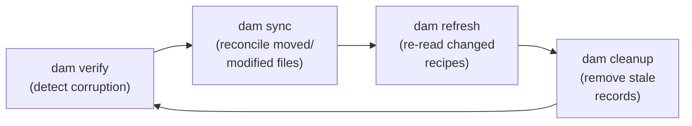

# Maintenance

Over time, files move, drives get swapped, external tools edit recipes, and storage devices accumulate stale references. This chapter covers the commands that keep your catalog accurate and your files healthy.

The four core maintenance commands form a cycle:



Each command is safe by default -- destructive operations require an explicit `--apply` flag, and most commands support `--dry-run` or report-only mode.


## Verification

`dam verify` re-hashes every file on disk and compares the result to the content hash stored in the catalog. This detects silent corruption, bit rot, and accidental modifications.

### Verify everything

```bash
dam verify
```

This walks all file locations on all online volumes. Offline volumes are skipped automatically.

Sample output:

```
Verify complete: 1847 verified, 2 modified, 0 FAILED, 3 skipped
```

### Verify specific files or directories

```bash
dam verify /Volumes/PhotosDrive/Capture/2026-02-01
```

Only files under the given path are checked.

### Limit to a volume

```bash
dam verify --volume "Photos 2024"
```

Useful when you reconnect a drive and want to spot-check it before trusting its contents.

### Verify a single asset

```bash
dam verify --asset a1b2c3d4
```

Asset IDs can be abbreviated to a unique prefix.

### Filter by file type

```bash
# Only verify RAW files
dam verify --include raw

# Skip audio files
dam verify --skip audio
```

### Two verification modes

**Catalog mode** (no paths): `dam verify` walks all file locations known to the catalog on online volumes. This checks whether your cataloged files are intact.

**Path mode** (with paths): `dam verify /some/path` scans files on disk and looks them up in the catalog. This also detects files that are not in the catalog at all.

### What the results mean

- **verified** -- file hash matches the catalog. The `verified_at` timestamp is updated.
- **modified** -- a recipe file (`.xmp`, `.cos`, etc.) was changed externally. dam updates the stored hash and reports it as "modified" rather than "FAILED". This is expected when CaptureOne or Lightroom edits a sidecar.
- **FAILED** -- a media file's hash does not match. This indicates corruption, accidental overwrite, or a file that was replaced. Investigate immediately.
- **MISSING** -- a file referenced in the catalog no longer exists on disk (catalog mode only). The file's location record exists but the file is gone from an online volume.
- **UNTRACKED** -- a file was found on disk but is not in the catalog (path mode only). The file's content hash does not match any known variant or recipe. Run `dam import` to bring it into the catalog, or ignore it if it is not a media file.
- **skipped** -- the file is on an offline volume, or the path could not be read.

If any files fail verification (FAILED status), dam exits with code 1. Scripts can check `$?` to detect problems:

```bash
dam verify --volume "Archive" || echo "Integrity check failed!"
```

### Monitoring flags

```bash
# Per-file progress to stderr
dam verify --log

# Machine-readable output
dam verify --json

# Show elapsed time
dam verify --time

# Combine them
dam verify --volume "Photos 2024" --log --time
```

### Checking verification age

Use the `stale:N` search filter to find assets that have not been verified recently:

```bash
# Assets not verified in the last 30 days
dam search "stale:30"

# Assets never verified
dam search "stale:0"
```

See [Browsing & Searching](05-browse-and-search.md) for more on search filters.


## Sync

`dam sync` reconciles the catalog with what is actually on disk. Run it after moving, renaming, or deleting files with external tools (Finder, `mv`, CaptureOne's "move to folder", etc.).

Unlike `verify` (which only checks hashes), `sync` scans the filesystem for structural changes: files that moved, new files that appeared, and files that disappeared.

### Report mode (safe default)

```bash
dam sync /Volumes/PhotosDrive/Photos/
```

Without `--apply`, sync scans the directory and reports what it finds, but changes nothing:

```
Sync complete: 1200 unchanged, 3 moved, 2 new, 1 modified, 4 missing
  Tip: run 'dam import' to import new files.
```

### Apply changes

```bash
dam sync /Volumes/PhotosDrive/Photos/ --apply
```

With `--apply`, sync updates the catalog and sidecar files:

- **Moved files**: The catalog path is updated to the new location (same content hash found at a different path, old path gone).
- **Modified recipes**: Recipe hash is updated, and if it is an XMP file, metadata is re-extracted.
- **Missing files**: Reported but not removed (use `--remove-stale`).
- **New files**: Reported but not imported. Run `dam import` separately.

### Removing stale records

```bash
dam sync /Volumes/PhotosDrive/Photos/ --apply --remove-stale
```

`--remove-stale` (which requires `--apply`) removes catalog location records for files that are confirmed missing. Use this when you intentionally deleted files and want the catalog to reflect that.

### Scoping to a volume

```bash
dam sync /Volumes/PhotosDrive/ --volume "Photos 2024"
```

Explicitly sets the volume context when auto-detection picks the wrong one.

### Detection categories

| Status | Meaning | Action with `--apply` |
|--------|---------|----------------------|
| unchanged | Hash matches at expected path | None |
| moved | Known hash found at new path, old path gone | Path updated in catalog |
| new | Unknown hash, not in catalog | Reported (run `dam import`) |
| modified | Same path, different hash (recipe files) | Hash updated, XMP re-extracted |
| missing | Catalog location exists but file is gone | Reported, or removed with `--remove-stale` |

### Monitoring flags

```bash
dam sync /Volumes/PhotosDrive/ --apply --log --time --json
```

`--log` shows per-file status, `--time` shows elapsed time, `--json` outputs structured results.


## Refresh

`dam refresh` re-reads metadata from recipe and media files without scanning the full filesystem. It is lighter than `sync` -- it only checks files the catalog already knows about, comparing their on-disk hash to the stored hash.

This is the right tool after editing in CaptureOne, Lightroom, or any other tool that modifies XMP sidecars.

### Refresh all recipes

```bash
dam refresh
```

Checks every recipe file location on all online volumes. For each recipe whose hash has changed:

- **XMP recipes** (`.xmp`): re-extracts keywords, rating, description, and color label, then updates the catalog and sidecar YAML.
- **Non-XMP recipes** (`.cos`, `.pp3`, `.dop`, etc.): hash updated, but no metadata extraction (these formats are opaque to dam).

### Refresh specific paths

```bash
dam refresh /Volumes/PhotosDrive/Capture/2026-02-01/
```

Only checks recipe files under the given path.

### Limit to a volume or asset

```bash
# All recipes on a specific volume
dam refresh --volume "Photos 2024"

# Only recipes for a specific asset
dam refresh --asset a1b2c3d4
```

### Re-extract embedded XMP from media files

```bash
dam refresh --media
```

The `--media` flag also scans JPEG and TIFF variant files, re-extracting embedded XMP metadata. This is useful in two scenarios:

1. **Retroactive extraction**: You imported files before the embedded XMP feature existed and want to pick up keywords/ratings/labels that were embedded all along.
2. **External edits**: A tool like CaptureOne or Lightroom modified the embedded XMP in a JPEG/TIFF file.

### Dry run

```bash
dam refresh --dry-run
```

Shows what would change without applying anything. Combine with `--log` for detailed output:

```bash
dam refresh --dry-run --log
```

Sample output:

```
  DSC_001.xmp — changed (12ms)
  DSC_002.xmp — unchanged (3ms)
  DSC_003.xmp — changed (11ms)
Dry run — Refresh complete: 2 refreshed, 1 unchanged, 0 missing, 0 skipped (offline)
```

### Monitoring flags

```bash
dam refresh --log --time --json
```


## Cleanup

`dam cleanup` scans all file locations and recipes across online volumes, checking whether the referenced files still exist on disk. It removes stale records in three passes.

### Report mode (safe default)

```bash
dam cleanup
```

Without `--apply`, cleanup reports what it finds:

```
Cleanup complete: 1500 checked, 12 stale, 3 orphaned assets, 5 orphaned previews
  Run with --apply to remove stale records, orphaned assets, and previews.
```

### Apply cleanup

```bash
dam cleanup --apply
```

The three passes:

1. **Stale location and recipe records**: Removes catalog entries for files that no longer exist on disk (variant file locations and recipe file locations). Updates sidecar YAML files accordingly.
2. **Orphaned assets**: Deletes assets where all variants have zero file locations remaining. Their recipes, variants, catalog rows, and sidecar YAML files are removed.
3. **Orphaned previews**: Removes preview JPEG files whose content hash no longer matches any variant in the catalog.

### Limit to a specific volume

```bash
dam cleanup --volume "Photos 2024" --apply
```

Only scans file locations on the specified volume. Useful after removing a drive's contents intentionally.

### List stale entries

```bash
dam cleanup --list
```

Prints stale entries to stderr (similar to `--log`, but only shows stale entries rather than every file checked).

### Offline volumes

Offline volumes are skipped automatically with a note. dam never removes records for files on an offline volume -- it cannot know whether the file is truly gone or just disconnected.

### Monitoring flags

```bash
dam cleanup --apply --log --time --json
```


## Relocating Assets

`dam relocate` copies (or moves) all of an asset's files -- variants and recipes -- to another volume. Use this to migrate assets between drives, create backups on a second volume, or consolidate scattered files.

### Copy to another volume

```bash
dam relocate a1b2c3d4 "Archive Drive"
```

This copies all files for the asset to the target volume, preserving their relative paths. The asset now has files on both volumes. After the copy, each file is verified via SHA-256 to ensure integrity.

### Move (copy + delete source)

```bash
dam relocate a1b2c3d4 "Archive Drive" --remove-source
```

With `--remove-source`, the source files are deleted after successful copy and verification. The asset's locations are updated to point to the new volume only.

### Dry run

```bash
dam relocate a1b2c3d4 "Archive Drive" --dry-run
```

Shows what would be copied or moved without making any changes:

```
Dry run — no changes made:
  Copy Capture/2026-02-01/DSC_001.nef → Archive Drive:Capture/2026-02-01/DSC_001.nef
  Copy Capture/2026-02-01/DSC_001.xmp → Archive Drive:Capture/2026-02-01/DSC_001.xmp
```


## Updating File Locations

`dam update-location` fixes the catalog after you manually moved a single file on disk. Unlike `sync` (which scans a directory), this command targets one specific file.

### Basic usage

```bash
dam update-location a1b2c3d4 \
    --from Capture/2026-02-01/DSC_001.nef \
    --to /Volumes/PhotosDrive/Archive/2026/DSC_001.nef
```

- `--to` must be an absolute path to the file's current location on disk.
- `--from` can be absolute or volume-relative (the path as it appears in the catalog).

### How it works

1. dam resolves the asset by ID (or unique prefix).
2. The volume is auto-detected from `--to` by matching against registered volume mount points. You can override with `--volume`.
3. dam hashes the file at `--to` and compares it to the stored content hash. If they do not match, the command fails (safety check -- you may have pointed to the wrong file).
4. The catalog and sidecar YAML are updated with the new path.

### Specifying the volume explicitly

```bash
dam update-location a1b2c3d4 \
    --from Capture/old/DSC_001.nef \
    --to /Volumes/NewDrive/Capture/new/DSC_001.nef \
    --volume "New Drive"
```

This also handles recipe file locations, not just variant files.


## Rebuilding the Catalog

`dam rebuild-catalog` wipes the SQLite database and reconstructs it from the YAML sidecar files, which are the source of truth.

```bash
dam rebuild-catalog
```

Sample output:

```
Rebuild complete: 1847 assets, 2914 variants, 312 recipes, 3 collections, 45 stacks
```

### When to use it

- The SQLite database is corrupted or deleted.
- You manually edited sidecar YAML files and want the catalog to reflect those changes.
- Something seems out of sync and you want a clean slate.

### What is preserved

- **Sidecar YAML files**: Untouched (they are the source, not the target).
- **Collections**: Restored from `collections.yaml` at the catalog root.
- **Stacks**: Restored from `stacks.yaml` at the catalog root (member order and pick assignments are preserved).
- **Faces and people** *(ai feature)*: Restored from `faces.yaml` and `people.yaml`. ArcFace face embeddings restored from binary files in `embeddings/arcface/`.
- **Image embeddings** *(ai feature)*: SigLIP embeddings restored from binary files in `embeddings/<model>/`.
- **Preview files**: Untouched (they are content-addressed by hash).
- **Volumes**: Re-registered from `volumes.yaml`.

### What is regenerated

- All SQLite tables (assets, variants, recipes, file locations, tags, stacks).
- Denormalized columns (`best_variant_hash`, `primary_variant_format`, `variant_count`).
- Collection membership records (from `collections.yaml`).
- Stack membership records (from `stacks.yaml`).

This is a safe operation -- only the derived cache (SQLite) is rebuilt. No files on disk are modified or deleted.


## Fix Dates

`dam fix-dates` corrects asset dates that were set incorrectly during import. This commonly happens when files lack EXIF metadata (e.g., old JPEGs without DateTimeOriginal) — the import timestamp was used instead of the capture date.

### How it works

For each asset, `fix-dates` collects candidate dates from all variants:

1. **EXIF DateTimeOriginal** from stored `source_metadata` (for assets imported since v1.3.1)
2. **Re-extracted EXIF** from the file on disk (for older assets without stored date)
3. **File modification time** on disk

The oldest date across all variants becomes the corrected `created_at`.

### Report mode (safe default)

```bash
dam fix-dates
```

Shows what would be changed:

```
Warning: volume 'Archive' is offline — cannot read files for date extraction
Fix-dates: 5000 checked, 3200 fixed, 800 already correct, 1000 skipped (volume offline)
  Run with --apply to make changes.
  Mount offline volumes and re-run to fix remaining assets.
```

### Apply fixes

```bash
dam fix-dates --apply --log
```

Updates both the SQLite catalog and sidecar YAML files. Also backfills EXIF dates into variant metadata so future runs work without needing the volume online.

### Offline volumes

`fix-dates` needs file access for EXIF re-extraction and file modification times. Assets on offline volumes are skipped with a clear message. Mount the volume and re-run to fix them.

### Scope to a volume or asset

```bash
# Fix dates for assets on a specific volume
dam fix-dates --volume "Photos 2024" --apply --log

# Fix a single asset
dam fix-dates --asset a1b2c3d4 --apply
```


## Fix Roles

`dam fix-roles` corrects variant roles in assets that have both RAW and non-RAW variants. In these groups, the RAW variant should be the Original and non-RAW variants should be Exports. If roles are incorrect (e.g., both marked as Original), this command fixes them.

### Report mode (safe default)

```bash
dam fix-roles
```

Shows what would be changed:

```
Dry run — Fix-roles: 150 checked, 3 fixed (5 variant(s)), 147 already correct
  Run with --apply to make changes.
```

### Apply fixes

```bash
dam fix-roles --apply
```

Updates both the SQLite catalog and sidecar YAML files.

### Scope to a volume or asset

```bash
# Only check assets on a specific volume
dam fix-roles --volume "Photos 2024" --apply

# Fix a single asset
dam fix-roles --asset a1b2c3d4 --apply
```


## Recommended Maintenance Workflow

A practical schedule for keeping your catalog healthy:

### 1. Periodic integrity checks

Run `dam verify` on a regular schedule -- weekly for active volumes, monthly for archives:

```bash
# Verify the active working drive
dam verify --volume "Work SSD"

# Find assets that haven't been verified in 90 days
dam search "stale:90"
```

### 2. After editing in external tools

When you finish a session in CaptureOne, Lightroom, or another tool that edits XMP sidecars, run `dam refresh` to pick up the changes:

```bash
dam refresh --volume "Work SSD" --log
```

If the external tool also modified embedded metadata in JPEG/TIFF exports:

```bash
dam refresh --media --volume "Work SSD"
```

### 3. After moving or reorganizing files

If you moved files on disk (renamed directories, reorganized folder structure), run `dam sync` to reconcile:

```bash
# First, see what changed
dam sync /Volumes/PhotosDrive/Photos/

# Then apply
dam sync /Volumes/PhotosDrive/Photos/ --apply
```

If new files appeared (e.g., CaptureOne exported new TIFFs), import them:

```bash
dam import /Volumes/PhotosDrive/Photos/Exports/
```

### 4. Periodic cleanup

Run `dam cleanup` periodically to remove stale records for files that no longer exist:

```bash
# See what would be cleaned up
dam cleanup --list

# Apply
dam cleanup --apply
```

### 5. Nuclear option: rebuild

If the catalog seems fundamentally out of sync -- searches return wrong results, show displays stale data -- rebuild from the sidecar files:

```bash
dam rebuild-catalog
```

This is safe and fast. The sidecar YAML files are the source of truth; the SQLite database is just a derived cache.

### Putting it all together

A typical maintenance session after reconnecting an archive drive:

```bash
# 1. Check file integrity
dam verify --volume "Archive 2025" --time

# 2. Pick up any recipe changes made while the drive was connected elsewhere
dam refresh --volume "Archive 2025"

# 3. Reconcile any moved/renamed files
dam sync /Volumes/Archive2025/ --apply

# 4. Clean up any stale records
dam cleanup --volume "Archive 2025" --apply

# 5. Confirm everything looks good
dam stats --volumes
```

---

Next: [Scripting](08-scripting.md) -- shell and Python scripting patterns for workflow automation.

For complete flag and option details on every maintenance command, see the [Maintain Commands Reference](../reference/05-maintain-commands.md).
