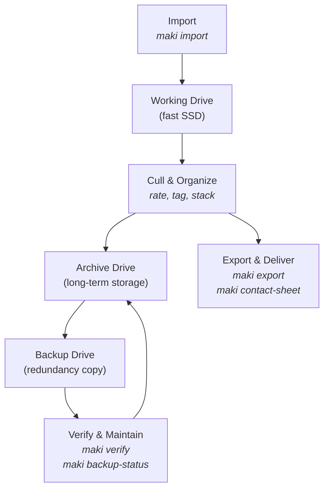

# The Archive Lifecycle

Most photography tools focus on individual tasks — importing, tagging, exporting. But the harder challenge is the long game: managing a growing library across multiple drives over years and decades. This chapter ties together the commands you've learned into a coherent storage strategy.

---

## The Big Picture

Files in a well-managed library flow through a predictable lifecycle. Each stage has a different purpose, and MAKI provides tools for every transition:



The flow is:

1. **Import** new files onto a fast working drive
2. **Cull and organize** while files are easily accessible
3. **Archive** completed work to reliable long-term storage
4. **Back up** the archive to a second (or third) drive
5. **Verify and maintain** on a regular schedule
6. **Export and deliver** from any stage

Each MAKI volume can be assigned a **purpose** (`media`, `working`, `archive`, `backup`, `cloud`) that reflects its role in this lifecycle. These purposes drive `maki backup-status` and `maki duplicates` analysis. See [Volume Purposes](02-setup.md#volume-purposes) for setup details.

---

## Stage 1: Import to Working Storage

A fast local SSD is the ideal landing zone for new files. Speed matters during import, culling, and preview generation.

The first step is getting files off the memory card and onto your working drive. Use your preferred method — Finder drag-and-drop, a card reader app, or a simple `rsync` script. Then import into MAKI:

```bash
# Register the working drive
maki volume add "Work SSD" /Volumes/FastSSD --purpose working

# Copy files from card to working drive (outside MAKI)
rsync -av /Volumes/CARD/DCIM/ /Volumes/FastSSD/Capture/2026-03-15/

# Import into MAKI
maki import /Volumes/FastSSD/Capture/2026-03-15/ --auto-group --smart --log
```

The `--smart` flag generates high-resolution previews (2560px) alongside regular thumbnails, enabling zoom and pan in the web UI even after the files move to a slower drive.

**Tip:** Use `--add-tag` to stamp each import session for easy retrieval later:

```bash
maki import /Volumes/FastSSD/Capture/2026-03-15/ \
  --add-tag "shoot:johnson-wedding" --auto-group --smart --log
```

---

## Stage 2: Cull and Organize

While files are on fast storage, do your creative work: rate, tag, describe, and build collections. This is the stage covered in [Organizing Assets](04-organize.md) and [Organizing & Culling](10-organizing-and-culling.md).

A typical post-import session:

```bash
# Start the web UI for visual culling
maki serve

# Or from the CLI:
# 1. Auto-group RAW+JPEG pairs
maki auto-group --apply

# 2. Tag obvious rejects
maki search -q "path:Capture/2026-03-15 -rating:1+" | xargs -I{} maki tag {} rest

# 3. Build a collection from selects
maki search -q "tag:johnson-wedding rating:4+" | xargs maki col add "Johnson Wedding Selects"
```

Don't rush this stage. Files on the working drive are fast to browse and easy to revisit. Move to archive only when you're satisfied with your curation.

---

## Stage 3: Archive Completed Work

Once a shoot or project is fully culled and organized, move it to long-term archive storage. This frees space on your working SSD while preserving everything in the catalog.

```bash
# Register the archive drive
maki volume add "Archive 2026" /Volumes/ArchiveDrive --purpose archive

# Preview the migration
maki relocate --query "tag:johnson-wedding" --target "Archive 2026" --dry-run

# Execute: copy files to archive
maki relocate --query "tag:johnson-wedding" --target "Archive 2026" --log

# After confirming the archive copy, free the working drive
maki relocate --query "tag:johnson-wedding volume:Work SSD" --target "Archive 2026" --remove-source --log
```

**Important:** Don't use `--remove-source` in the first pass. Copy first, verify, then remove the source in a second pass. This gives you a safety window.

After archiving, the files appear on both volumes during the transition. The working drive copy is removed only when you explicitly pass `--remove-source`.

---

## Stage 4: Create Backup Copies

An archive is only as good as its backup. Copy your archived files to a physically separate drive:

```bash
# Register the backup drive
maki volume add "Backup A" /Volumes/BackupDisk --purpose backup

# Copy the entire archive to the backup
maki relocate --query "volume:Archive 2026" --target "Backup A" --log
```

Note: `relocate` without `--remove-source` copies files — the originals stay on the archive drive. This is intentional: you now have two copies.

### The 3-2-1 rule

A solid backup strategy follows the 3-2-1 rule: **3 copies** of your data, on **2 different media types**, with **1 copy offsite**. With MAKI:

- **3 copies:** working + archive + backup (or archive + backup A + backup B)
- **2 media types:** SSD working drive + HDD archive + HDD backup
- **1 offsite:** A backup drive stored at a different physical location, or a `cloud` volume

Use `--min-copies` to enforce your policy:

```bash
# Check that every asset has at least 2 copies
maki backup-status --min-copies 2 --at-risk

# Stricter: require 3 copies for rated images
maki backup-status --min-copies 3 --at-risk -q "rating:1+"
```

---

## Stage 5: Verify and Maintain

Storage devices degrade silently. A file that reads fine today may return corrupted data tomorrow. Regular verification catches problems while you still have good copies elsewhere.

### Monthly routine

```bash
# Verify the archive drive (skip files checked within 30 days)
maki verify --volume "Archive 2026" --max-age 30 --log

# Check backup coverage
maki backup-status --at-risk

# Clean up any stale records
maki cleanup --apply
```

### After reconnecting an offline drive

When you reconnect a backup or archive drive that's been offline, run the full maintenance sequence:

```bash
# 1. Verify file integrity
maki verify --volume "Backup A" --time

# 2. Push pending MAKI edits to XMP files
maki writeback --volume "Backup A"

# 3. Pick up external recipe changes
maki refresh --volume "Backup A"

# 4. Reconcile moved/renamed files
maki sync /Volumes/BackupDisk/ --apply

# 5. Clean up stale records
maki cleanup --volume "Backup A" --apply

# 6. Check for accidental duplicates
maki duplicates --same-volume --volume "Backup A"
```

### Monitoring long-term health

Use saved searches and `stats` to keep an eye on your library:

```bash
# Save a search for single-copy assets (at risk)
maki ss save "At Risk" "copies:1" --favorite

# Save a search for assets not verified in 90 days
maki ss save "Stale" "stale:90" --favorite

# Overview of your storage
maki stats --volumes
```

---

## Stage 6: Export and Deliver

At any point in the lifecycle, you can export files for delivery, sharing, or printing — regardless of which volume holds the originals (as long as it's online):

```bash
# Client delivery as ZIP
maki export "collection:Johnson Wedding Selects" delivery.zip --zip

# Contact sheet for review
maki contact-sheet "collection:Johnson Wedding Selects" proofs.pdf \
  --title "Johnson Wedding" --copyright "Jane Doe Photography"

# Full export with sidecars for handoff to another tool
maki export "tag:johnson-wedding" /Volumes/USB/handoff --layout mirror --include-sidecars
```

---

## Putting It All Together: A Photographer's Monthly Workflow

Here is a concrete example of how these stages play out over a typical month:

### Week 1–2: Shoot and import

```bash
# Copy files from card to working SSD, then import
rsync -av /Volumes/CARD/DCIM/ /Volumes/FastSSD/Capture/Corporate-2026-03/
maki import /Volumes/FastSSD/Capture/Corporate-2026-03/ \
  --add-tag "shoot:corporate-2026-03" --auto-group --smart --log

rsync -av /Volumes/CARD/DCIM/ /Volumes/FastSSD/Capture/Landscape-Spring/
maki import /Volumes/FastSSD/Capture/Landscape-Spring/ \
  --add-tag "shoot:landscape-spring" --auto-group --smart --log
```

### Week 2–3: Cull and deliver

```bash
# Cull in the web UI, rate keepers, tag rejects as "rest"
maki serve

# Export selects for client
maki export "tag:corporate-2026-03 rating:4+" /tmp/delivery/ --zip
maki contact-sheet "tag:corporate-2026-03 rating:3+" proofs.pdf --title "Corporate Event"
```

### Week 4: Archive and back up

```bash
# Move completed shoots to archive
maki relocate --query "tag:corporate-2026-03" --target "Archive 2026" --log
maki relocate --query "tag:landscape-spring" --target "Archive 2026" --log

# Remove from working drive after confirming archive
maki relocate --query "tag:corporate-2026-03 volume:Work SSD" --target "Archive 2026" --remove-source
maki relocate --query "tag:landscape-spring volume:Work SSD" --target "Archive 2026" --remove-source

# Back up new archive content
maki relocate --query "volume:Archive 2026 copies:1" --target "Backup A" --log

# Verify and check coverage
maki verify --volume "Archive 2026" --max-age 30
maki backup-status --at-risk
```

### Result

After one month:
- Working SSD is clean, ready for next month's shoots
- Archive drive holds all culled and organized work
- Backup drive has a copy of everything on the archive
- `maki backup-status` confirms no at-risk assets
- All metadata, tags, ratings, and collections travel with the files via YAML sidecars

---

## When Things Go Wrong

Drives fail. It's not a question of if, but when. See [Recovering from a Drive Failure](07-maintenance.md#recovering-from-a-drive-failure) for a step-by-step recovery playbook.

The best defense is prevention: regular verification, backup coverage checks, and the discipline of always having at least two copies of every file you care about.

---

Previous: [Organizing & Culling](10-organizing-and-culling.md) |
[Back to Manual](../index.md)
